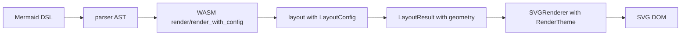

# xmermaid Architecture Redesign & Extension

Date: 2026-04-27

## 0. 术语约定

- `DiagramAst`：parser 输出的纯语法树，当前 flowchart 由 `FlowchartAst` 表示。
- `NodeShape`：parser 捕获的节点形状枚举，layout 映射为渲染层可消费的形状合同。
- `LayoutConfig`：layout 的输入配置，包含节点尺寸、间距、padding 和方向。
- `LayoutResult`：layout 的输出合同，包含 `LayoutNode`、`LayoutEdge` 和画布 `dimensions`。
- `LayoutEdge geometry v1`：layout 产出的显式边界几何字段，renderer 优先消费，用于箭头端点、线段终点和标签锚点。
- `RenderTheme`：SVG renderer 的主题合同，控制颜色、箭头、曲线、edge gap 和字体。
- `XMermaid`：浏览器端应用层入口，负责 WASM 初始化、layout 调用和 SVG DOM 挂载。

## 1. 决策与约束

**需求摘要**：Batch 1 只完成 flowchart 的架构解耦、边/箭头渲染修正、主题化和示例/测试补强。目标是让 parser、layout、renderer 通过稳定类型合同协作，后续图表类型可以在同一接口下扩展。

**明确不做**：

- 不在 Batch 1 实现 sequence/class/state/ER 等新图表类型。
- 不引入新的 npm 或 Rust 依赖。
- 不把渲染逻辑搬进 Rust；SVG DOM 仍由 TypeScript renderer 负责。
- 不把 examples 的浏览器验证产物、screenshots 或 Playwright 临时日志纳入 feature 范围。
- 不提交计划中的逐任务 commit；CodeStable 收尾遵循 scoped-commit，需要用户明确确认后再提交。

**复杂度档位**：中等。该 feature 横跨 Rust parser/layout/WASM、TypeScript SDK/renderer、测试和示例，但仍限定在 flowchart 主链路。

**关键决策**：

- Layout 以 `LayoutConfig` 为输入、以 `LayoutResult` 为输出，`compute_layout` 不再用 AST 方向覆盖显式 config。
- WASM `render_with_config` 接受 partial config：先从 AST 方向推导默认 config，再叠加用户字段，显式 `direction` 可覆盖 AST 方向。
- Renderer 优先使用 layout 产出的 geometry v1 字段；字段缺失时回退到 TS path helper。
- 主题合同放在 `src/types/theme.ts` 并由 `src/index.ts` 对外导出。

## 2. 名词与编排

### 2.1 名词层

**现状**：原架构中 layout 只给节点位置，renderer 需要自行推断边起止点和箭头位置；布局尺寸、间距、方向等配置分散在硬编码常量中。

**变化**：

- Rust layout types：`crates/xmermaid-layout/src/types.rs` 定义 `LayoutConfig`、`LayoutNode`、`LayoutEdge`、`LayoutResult`、`Bounds`、`Point`、`NodeShape` 和 `EdgeStyle`。
- Parser AST：`crates/xmermaid-parser/src/ast.rs` 中节点含 `shape`，parser 在 `parse_node_shape_and_label` 中解析形状语法。
- WASM contract：`crates/xmermaid-wasm/src/lib.rs` 暴露 `render`、`render_with_config` 和 `default_config`。
- TS types：`src/types/layout.ts` 与 `src/types/theme.ts` 同步 layout/theme 合同，`src/types/options.ts` 让 `XMermaidOptions` 接收 `theme` 与 `layoutConfig`。
- Renderer helpers：`src/renderer/edge.ts` 提供 bezier/step/straight path、shape boundary truncation 和 arrow point 计算。

接口示例：

```typescript
new XMermaid({
  container,
  theme: DARK_THEME,
  layoutConfig: { h_spacing: 100, direction: 'LR' },
});
```

```rust
let config = LayoutConfig { direction: FlowDirection::LR, ..LayoutConfig::default() };
let layout = compute_layout(&ast, &config);
```

### 2.2 编排层



**现状**：AST、layout 和 renderer 之间的边界不够清晰，renderer 混入 layout 几何推断。

**变化**：parser 只负责语法和 shape/style 信息；layout 负责节点 bounds、edge waypoints、geometry v1；renderer 负责 SVG path/shape/label/arrow DOM，且优先消费 layout 显式几何。

流程级约束：

- partial `layoutConfig` 不得丢失 DSL 方向默认值。
- 显式 `layoutConfig.direction` 必须能覆盖 AST 方向。
- line/invisible edge 不渲染 arrowhead。
- label anchor 优先级：`label_anchor` > `label_position` > renderer fallback。
- examples 必须加载构建后的 `dist/xmermaid.esm.js` 并实际渲染 SVG。

### 2.3 挂载点

- Parser AST 和 parser shape/edge parsing：删除后 flowchart shape/style 合同消失。
- Layout public contract 和 flowchart layout：删除后 `LayoutConfig`/`LayoutResult` 解耦消失。
- WASM render API：删除后 JS SDK 无法以新合同调用 layout。
- TypeScript layout/theme/options types：删除后 SDK 用户无法类型化配置 layout 和 renderer。
- SVG renderer/edge helpers：删除后新边界截断、箭头和主题渲染消失。
- examples/tests：删除后 Batch 1 的端到端和回归证据消失。

### 2.4 推进策略

1. Rust layout/parser 合同落地。
2. Flowchart layout engine 拆分并输出 `LayoutResult`。
3. WASM binding 暴露 config/render 合同。
4. TypeScript layout/theme/options 类型落地。
5. Edge path helper 和 SVG renderer 消费新合同。
6. XMermaid class 接通 WASM config 与 renderer theme。
7. Rust/TS 测试覆盖 parser、layout、edge、renderer、theme、SDK。
8. examples 与 build/browser/release 验证收尾。

### 2.5 结构健康度与微重构

本次 feature 已经通过新文件承载新增职责：`crates/xmermaid-layout/src/types.rs`、`crates/xmermaid-layout/src/flowchart.rs`、`src/renderer/edge.ts`、`src/types/theme.ts`，避免继续把边几何和主题逻辑堆进既有入口。当前不追加新的结构性微重构；parser 模块拆分到 `flowchart/` 子模块属于后续更大 parser architecture 工作，不阻塞 Batch 1。

## 3. 验收契约

- S1：`cargo test` 通过，并覆盖 parser shape/edge label、layout bounds/waypoints/directions/custom config/same-rank spacing、WASM partial config。
- S2：`npm test` 和 `npm run typecheck` 通过，并覆盖 edge path、renderer DOM、theme、XMermaid options。
- S3：`npm run build` 和 `npm run verify:release` 通过。
- S4：`examples/basic.html` 浏览器加载后产生 1 个 `svg.xmermaid-diagram`，无 error 文本和 console error。
- S5：`examples/flowchart-complex.html` 浏览器加载后产生 2 个 SVG，包含 15+ 节点复杂图、subgraph、长标签、循环、多输入/多输出。
- S6：`examples/flowchart-directions.html` 浏览器加载后产生 TB/LR/RL/BT 四个 SVG。
- S7：`examples/theme-comparison.html` 浏览器加载后产生 default/dark/minimal 三个 SVG。
- 反向核对：不新增非 flowchart 图表类型、不新增依赖、不提交构建产物或 Playwright 临时资产、不改 live-editor feature 范围。

## 4. 与项目级架构文档的关系

已在 `.codestable/architecture/ARCHITECTURE.md` 归并当前 Flowchart 解耦合同：parser/layout/renderer 数据流、`LayoutConfig` partial config 语义、`LayoutResult`/geometry v1、`RenderTheme` 与 `XMermaidOptions`。本 feature 不从 roadmap 起头，`.codestable/requirements/` 当前无对应 requirement；acceptance 阶段记录为跳过 requirement/roadmap 回写。

## Problem Statement

1. **Tight coupling**: Layout engine hardcodes rendering constants (NODE_WIDTH, NODE_HEIGHT, etc.); SVG renderer computes edge start/end points, mixing layout logic with drawing logic.
2. **Edge/arrow rendering issues**: Arrows are partially hidden by node fills; edges overlap node borders; arrow direction is unclear; same-level nodes have inconsistent spacing.
3. **Single chart type**: Only flowchart is supported; adding new types requires scattered changes across all layers.
4. **Insufficient testing**: Only one basic HTML example; no coverage for complex layouts, edge cases, or visual regression.

## Design Decisions

- **Architecture**: Interface-driven decoupling (Approach A). Three layers communicate through typed contracts; each layer depends on interfaces, not implementations.
- **Visual style**: vue-flow style by default — smooth bezier curves, clear filled arrows, breathing space between edges and nodes. Theme switching supported via `RenderTheme`.
- **Extension strategy**: Strategy pattern for chart types. Each type implements its own Parser module, Layout function, and RenderStrategy. New types plug in without modifying existing code.
- **Implementation**: Incremental batches. Batch 1 completes decoupling + flowchart refinement; subsequent batches add 2-3 types each.

## Architecture: Interface-Driven Decoupling

### Data Flow

```
┌─────────┐     AST (pure syntax tree)     ┌─────────┐  LayoutResult   ┌───────────┐
│  Parser  │ ─────────────────────────────→ │  Layout  │ ─────────────→ │ Renderer  │ → SVG
└─────────┘                                 └─────────┘                 └───────────┘
                                                 ↑                           ↑
                                            LayoutConfig               RenderTheme
                                          (sizes/spacing/direction)  (colors/arrow/curve)
```

### AST (unchanged)

Parser outputs a pure syntax tree. Structure varies by diagram type but is always a data-only representation with no layout or rendering information.

### LayoutConfig (new)

Replaces all hardcoded constants in the layout engine. Passed as input to Layout.

```typescript
interface LayoutConfig {
  nodeWidth: number;      // default 120
  nodeHeight: number;     // default 40
  hSpacing: number;       // horizontal spacing between nodes, default 60
  vSpacing: number;       // vertical spacing between ranks, default 60
  padding: number;        // canvas padding, default 40
  direction: FlowDirection;
}
```

### LayoutResult (extended)

Layout output now includes edge paths and node bounding boxes, not just center positions.

```typescript
interface LayoutResult {
  nodes: LayoutNode[];
  edges: LayoutEdge[];
  dimensions: Dimensions;
}

interface LayoutNode {
  id: string;
  center: Point;
  bounds: Bounds;          // { x, y, width, height } — absolute bounding box
  shape: NodeShape;        // forwarded from AST; Layout may adjust bounds based on shape
}

interface LayoutEdge {
  from: string;
  to: string;
  waypoints: Point[];      // path points including start/end at node centers
  labelPosition?: Point;
}
```

### RenderTheme (new)

Renderer styling configuration. Supports theme switching.

```typescript
interface RenderTheme {
  name: string;
  colors: ThemeColors;
  arrowStyle: 'triangle' | 'filled' | 'open' | 'circle' | 'cross';
  curveStyle: 'bezier' | 'step' | 'straight';  // default bezier (vue-flow style)
  edgeGap: number;         // gap between edge endpoint and node border, default 8
  arrowSize: number;       // arrowhead size, default 10
  nodeBorderRadius: number;
  fontFamily: string;
  fontSize: number;
}
```

### Key Changes

1. Layout layer computes edge paths (waypoints); Renderer no longer calculates start/end points.
2. Layout layer receives sizes via LayoutConfig; no hardcoded constants.
3. Renderer draws edges from waypoints + theme only; it does not know the layout algorithm.
4. Each chart type has its own Layout strategy and Renderer strategy.

## Edge & Arrow Rendering

### Core Principle

Edges start from the source node border, terminate at the target node border. Arrow tip touches the target border. A configurable `edgeGap` separates the edge from the node.

### Edge Truncation & Arrow Positioning (Renderer responsibility)

```
Source border ──[edgeGap]──→ edge start ──────→ edge end ──[edgeGap + arrowSize]──→ Target border
                                                                      ↑
                                                               arrow tip position
```

Algorithm:
1. From the last segment of waypoints, compute the ray's intersection with the target node bounding box.
2. Place arrow tip at the intersection point. Arrow extends backward by `arrowSize`.
3. Edge endpoint is at the arrow tail (intersection - edgeGap - arrowSize direction).
4. Edge start: compute intersection with source node bounding box from the first segment, then offset by `edgeGap`.

### Curve Styles

- **bezier** (default): Smooth cubic bezier curves. Control points auto-calculated from segment direction. This is the vue-flow default style.
- **step**: Right-angle polyline with 90° turns at midpoints.
- **straight**: Direct line (only applicable when start/end are on the same horizontal or vertical axis).

### Arrow Style

Default `filled` (solid triangle), consistent with vue-flow style. Size controlled by `arrowSize`, ensuring visibility at any zoom level.

### Uniform Same-Level Spacing

Layout algorithm improvements:
- Nodes on the same rank have aligned y-coordinates.
- Horizontal spacing between adjacent same-rank nodes is uniformly `hSpacing`.
- Each rank is center-aligned relative to the overall layout width.

## Chart Type Extension Architecture

### Parser Layer: One Module Per Type

```
xmermaid-parser/src/
  ast.rs              # DiagramAst enum (shared across all types)
  lexer.rs            # Common lexer base
  parser.rs           # Entry: dispatch by keyword to specific parser
  flowchart/
    lexer.rs
    parser.rs
  sequence/
    lexer.rs
    parser.rs
  class_diagram/
    ...
```

`DiagramAst` enum extends with each type:

```rust
enum DiagramAst {
  Flowchart(FlowchartAst),
  Sequence(SequenceAst),
  ClassDiagram(ClassAst),
  StateDiagram(StateAst),
  ErDiagram(ErAst),
}
```

### Layout Layer: Strategy Dispatch

```rust
fn compute_layout(ast: &DiagramAst, config: &LayoutConfig) -> LayoutResult {
    match ast {
        DiagramAst::Flowchart(fc) => flowchart::layout(fc, config),
        DiagramAst::Sequence(seq) => sequence::layout(seq, config),
        // ...
    }
}
```

Each type's layout function has a unified signature: `fn layout(ast: &T, config: &LayoutConfig) -> LayoutResult`. Output is always the same `LayoutResult` structure, so the Renderer does not need to know the diagram type.

### Renderer Layer: Strategy Registration

```typescript
class SVGRenderer {
  private strategies: Map<string, RenderStrategy>;

  render(ast: DiagramAst, layout: LayoutResult): SVGElement {
    const typeKey = getDiagramType(ast);
    const strategy = this.strategies.get(typeKey) ?? this.defaultStrategy;
    return strategy.render(ast, layout, this.theme);
  }
}

interface RenderStrategy {
  render(ast: DiagramAst, layout: LayoutResult, theme: RenderTheme): SVGElement;
}
```

Each chart type can have its own node shapes, edge styles, and special elements (e.g., Sequence lifelines, Class compartments), all plugged in through the unified `RenderStrategy` interface.

### Batch Implementation Plan

| Batch | Types | Rationale |
|-------|-------|-----------|
| 1 | Flowchart (refactor & refine) | Existing base; complete decoupling and edge/arrow optimization first |
| 2 | Sequence + State | Most commonly used; relatively regular layout (vertical timeline) |
| 3 | Class + ER | UML/database scenarios; structured layout |
| 4 | Gantt + Pie + Quadrant | Chart types; very different layout logic |
| 5 | Remaining types | Mindmap, Timeline, Sankey, C4, etc. |

Each batch delivers a working increment; no long periods without runnable output.

## Testing & Examples

### Rust Unit Tests (Parser + Layout)

Inline `#[cfg(test)]` modules in each parser and layout file.

Coverage:
- Parser: valid syntax parsing, invalid syntax error reporting, edge cases (empty diagram, single node, self-loops).
- Layout: nodes stay within bounds, same-rank spacing is uniform, edge paths are reasonable, all directions (TB/LR/RL/BT).

### JS Integration Tests (End-to-End)

Snapshot tests on HTML examples using Playwright or similar, verifying rendered output does not regress.

### Example Files

```
examples/
  basic.html                # Simple flowchart
  flowchart-complex.html    # 15+ nodes, subgraphs, long labels, self-loops, multi-in/out
  flowchart-directions.html # Same diagram in TB/LR/RL/BT
  sequence-basic.html       # Basic sequence diagram
  sequence-complex.html     # 6+ participants, alt/opt/loop groups, self-calls
  state-basic.html          # Basic state diagram
  class-basic.html          # Basic class diagram
  er-basic.html             # Basic ER diagram
  theme-comparison.html     # Same chart in 3 themes
```

Complex scenario requirements:
- **flowchart-complex**: 15+ nodes with subgraphs, long text labels, self-loops, multi-input/multi-output nodes.
- **flowchart-directions**: Same diagram rendered in all four directions for visual comparison.
- **sequence-complex**: 6+ participants with alt/opt/loop groups, self-invocation, delay annotations.
- **theme-comparison**: Same flowchart rendered with 3 different themes for visual comparison.

### Test Priority

Batch 1 focuses on Flowchart-related tests and examples. Subsequent batches add tests and examples alongside new chart types.

## Scope

This spec covers Batch 1 only: architecture decoupling, edge/arrow optimization, and Flowchart refinement. Subsequent batches will be specified separately as each batch completes.
