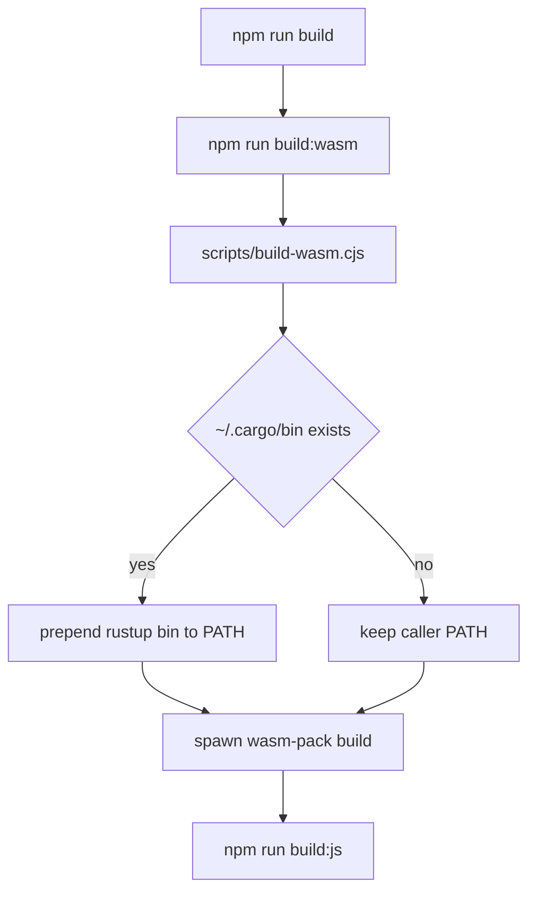

# build-toolchain-gate design

## 0. 术语约定

- **发布构建门禁**：`npm run build`，必须同时完成 WASM package 生成和 JS bundle 生成。grep `build:wasm` / `build:js` 未发现同名冲突。
- **rustup toolchain path**：`$HOME/.cargo/bin` 中由 rustup 管理的 `rustc` / `cargo` shim。当前机器同时存在 Homebrew Rust 和 rustup Rust，普通 PATH 会先命中 Homebrew。
- **WASM target**：`wasm32-unknown-unknown`。当前 rustup toolchain 已安装该 target，Homebrew sysroot 未安装该 target。
- **toolchain gate**：构建前置检查和 PATH 修正脚本，不改变 Rust crate 行为，只保证构建命令选择正确工具链并给出可诊断失败。

## 1. 决策与约束

### 需求摘要

本 feature 修复 `npm run build` 在当前环境下失败的问题。成功标准：不手动改 shell PATH，直接运行 `npm run build` 能复现通过；如果缺少 rustup、wasm-pack 或 WASM target，错误信息必须直接指向缺失前置条件。

明确不做：

- 不改 Rust parser/layout/wasm 业务代码。
- 不升级 wasm-pack 或新增依赖。
- 不把 `dist/` / `pkg/` 构建产物纳入提交。
- 不引入 CI 配置；CI gate 在后续 `release-verification-contract` 处理。

### 复杂度档位

走“单仓库构建脚本”默认档位，无服务端、并发、状态持久化或用户 UI 偏离。

### 关键决策

- 使用 Node `.cjs` 脚本包裹 `wasm-pack build`，而不是在 `package.json` 里写内联 `PATH="$HOME/.cargo/bin:$PATH"`。原因：脚本可以做前置检查和诊断，后续 verification contract 也能复用。
- 优先把 `$HOME/.cargo/bin` 放到 child process PATH 前面，但不强制要求 rustup；如果没有 rustup shim，保留调用者 PATH，让非 rustup 环境仍可自行提供可用 rustc。
- 失败时透传 `wasm-pack` exit code，不伪造成功。

## 2. 名词与编排

### 2.1 名词层

**现状**：

- `package.json` 的 `build:wasm` 直接调用 `wasm-pack build crates/xmermaid-wasm --out-dir ../../pkg --target web`。
- `src/wasm.ts` 固定动态导入 `../pkg/xmermaid_wasm.js`，所以 WASM package 生成位置不能变。

**变化**：

- 新增 `scripts/build-wasm.cjs` 作为 `build:wasm` 的唯一入口。
- `build:wasm` 保持生成 `pkg/` 的对外结果不变，只改变执行前置检查和 PATH 选择。

接口示例：

```bash
# 来源：package.json scripts.build:wasm
npm run build:wasm
# 正常：使用 rustup PATH 中的 rustc/cargo，生成 pkg/xmermaid_wasm.js 和 pkg/xmermaid_wasm_bg.wasm
# 错误：缺 wasm-pack / Rust target / rustc 时退出非 0，并打印 xmermaid build-wasm diagnostic
```

### 2.2 编排层



**现状**：构建流程是线性的 npm script，`build:wasm` 完全依赖外部 PATH。当前普通 shell 下先命中 `/opt/homebrew/bin/rustc`，导致 wasm target 检查失败。

**变化**：`build:wasm` 增加一个本地脚本节点，在调用 `wasm-pack` 前构造 deterministic PATH。JS bundle 仍由现有 `rollup -c` 执行。

流程级约束：

- 脚本只改变 child process 环境，不修改用户 shell。
- 脚本失败必须返回原始非 0 exit code。
- 诊断只解释环境前置，不吞掉 wasm-pack 原始 stderr/stdout。

### 2.3 挂载点清单

- `package.json` scripts：修改 `build:wasm` 入口为 `node scripts/build-wasm.cjs`。
- `scripts/build-wasm.cjs`：新增项目构建脚本入口。

### 2.4 推进策略

1. 构建脚本骨架：新增 Node 脚本，原样调用 `wasm-pack build`。
   退出信号：`npm run build:wasm` 能执行到 wasm-pack。
2. toolchain PATH gate：脚本优先把 `$HOME/.cargo/bin` 放到 child PATH 前面。
   退出信号：普通 `npm run build` 不再命中 Homebrew sysroot 失败。
3. 失败诊断：缺工具链或 wasm target 时打印稳定 diagnostic。
   退出信号：脚本失败路径不吞掉原始错误，且有 xmermaid 前缀提示。
4. 验证覆盖：运行 build/test/typecheck/cargo。
   退出信号：发布构建和现有测试命令都通过，构建产物仍被 gitignore 排除。

### 2.5 结构健康度与微重构

##### 评估

- 文件级 — `package.json`：脚本区很小，本次只改一行 script，不需要拆。
- 目录级 — `scripts/`：当前不存在；新增一个专用构建脚本目录，不形成摊平问题。
- compound convention：`.codestable/compound` 无相关 decision/trick/learning 文档。

##### 结论：不做微重构

本 feature 只新增一个独立构建脚本并修改 npm script，不需要拆分现有文件或重组目录。

## 3. 验收契约

关键场景：

- S1：普通环境下运行 `npm run build` → 先完成 WASM package，再完成 Rollup JS bundle，exit 0。
- S2：运行 `npm run build:wasm` → 生成 `pkg/xmermaid_wasm.js` 和 `pkg/xmermaid_wasm_bg.wasm`，exit 0。
- S3：运行 `npm test`、`npm run typecheck`、`cargo test` → 现有行为不回退。
- S4：运行 `git status --short` → `dist/` 和 `pkg/` 仍不作为 tracked 改动出现。

反向核对项：

- 不修改 `crates/xmermaid-*` 源码。
- 不修改 `src/wasm.ts` 的 import 路径。
- 不提交 `dist/` / `pkg/` 构建产物。

## 4. 与项目级架构文档的关系

本 feature 不改变 xmermaid 的 parser/layout/renderer 架构，只新增发布构建门禁脚本。acceptance 阶段需要评估是否把“构建必须优先 rustup PATH”归入 `.codestable/attention.md`，architecture 不需要新增系统结构描述。
