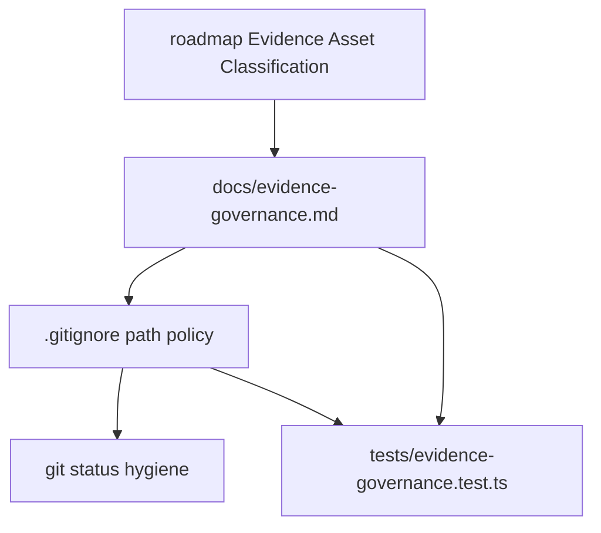

# codestable-evidence-governance design

## 0. 术语约定

- **Evidence Asset Classification**：来自 roadmap 第 4.3 节的证据资产分类协议，包含 `repo-spec`、`diagnostic-tool`、`runtime-cache`、`visual-evidence`、`private-log`。
- **repo-spec**：应进入仓库的长期 CodeStable 规格、验收、审计、架构或 roadmap 文档。
- **runtime-cache**：本地工具可重新生成的缓存，例如 `.codegraph/`。
- **private-log**：只对本地 agent/session 有意义的运行日志和状态，例如 `.omx/`。
- **visual-evidence**：作为审查或回归基线保留的截图资产；非基线截图默认不提交。
- **diagnostic-tool**：可维护、可重复运行的诊断脚本，必须有稳定路径和用途说明。

## 1. 决策与约束

### 需求摘要

本 feature 治理当前未跟踪的 CodeStable 和诊断资产，使长期 evidence 进入仓库、运行时缓存和私有日志不污染提交。成功标准：`.codestable/` 作为长期规格目录可被提交；`.omx/` 和 `.codegraph/` 被 ignore；截图和 CDP 临时脚本有明确策略；测试能机械验证策略覆盖 roadmap 第 4.3 节的分类。

明确不做：

- 不提交 `.omx/`、`.codegraph/`、`dist/` 或 `pkg/` 产物。
- 不修改 parser/layout/renderer/runtime 代码。
- 不引入 npm 依赖。
- 不把临时 CDP 脚本包装成正式工具；本次只定义并验证治理策略。
- 不决定具体截图 baseline 的视觉正确性；后续 `svg-geometry-regression-suite` 再消费该边界。

### 复杂度档位

走“仓库治理 + 测试守护”默认档位，无运行时 API、UI、并发或持久化服务。

### 关键决策

- 使用 `.gitignore` 表达提交边界，避免依赖人工记忆。
- 新增 `docs/evidence-governance.md` 作为人类可读政策说明，避免只靠 ignore 规则推断意图。
- 新增 `tests/evidence-governance.test.ts` 读取 `.gitignore` 和政策文档，验证五类 evidence asset 的归属规则都存在。
- 暂不移动 `cdp-*.cjs|mjs`；它们保持临时未提交状态，并由 `.gitignore` 排除，后续若需要保留再改名进入 `scripts/` 并补用途说明。

## 2. 名词与编排

### 2.1 名词层

**现状**：

- `.gitignore` 只列出 `.worktrees`、`node_modules`、`target`、`dist`、`pkg`。
- `.codestable/`、`.omx/`、`.codegraph/`、`screenshots/` 和根目录 `cdp-*` 脚本都显示为未跟踪或本地目录。
- roadmap 第 4.3 节已经定义 Evidence Asset Classification，但仓库没有可执行或可读的治理落点。

**变化**：

- `.gitignore` 明确忽略 runtime/private/generated 资产：`.omx/`、`.codegraph/`、非基线 `screenshots/`、根目录临时 `cdp-*`。
- `.codestable/` 不被 ignore，作为 `repo-spec` 进入仓库。
- 新增 `docs/evidence-governance.md`，列出五类资产及路径规则。
- 新增 `tests/evidence-governance.test.ts`，机械验证 `.gitignore` 和治理文档匹配上述策略。

接口示例：

```bash
git status --short
# 正常：.codestable/** 和 docs/evidence-governance.md 可见；.omx/**、.codegraph/**、screenshots/**、cdp-* 不出现

npm test -- tests/evidence-governance.test.ts
# 正常：五类 EvidenceAssetClass 均被政策文档覆盖，ignore 规则覆盖 runtime/private/generated 资产
```

### 2.2 编排层



**现状**：资产分类只存在 roadmap 规划里，实际提交边界靠人工判断。

**变化**：政策文档成为分类说明，`.gitignore` 成为 Git 边界，测试成为回归守护。后续 visual regression feature 可以直接引用政策里的 `visual-evidence` 规则决定截图是否纳入 baseline。

流程级约束：

- `.codestable/roadmap/**`、`.codestable/features/**`、`.codestable/audits/**` 默认属于 `repo-spec`。
- `.omx/**` 属于 `private-log`，不得提交。
- `.codegraph/**` 属于 `runtime-cache`，不得提交。
- `screenshots/**` 默认忽略；只有移动到明确 baseline/fixture 路径时才提交。
- 根目录 `cdp-*.cjs|mjs` 属于临时 diagnostic scratch，默认忽略。

### 2.3 挂载点清单

- `.gitignore`：定义 evidence asset 的提交/忽略边界。
- `docs/evidence-governance.md`：新增人类可读治理政策。
- `tests/evidence-governance.test.ts`：新增策略回归测试。

### 2.4 推进策略

1. 策略测试红灯：新增 evidence-governance 测试，先验证当前缺少政策/ignore 规则时失败。
   退出信号：`npm test -- tests/evidence-governance.test.ts` 因缺少政策或 ignore 规则失败。
2. 政策文档：新增 `docs/evidence-governance.md`，覆盖五类 EvidenceAssetClass。
   退出信号：测试不再因政策文档缺失失败。
3. ignore 边界：更新 `.gitignore`，忽略 runtime/private/generated 资产但不忽略 `.codestable/`。
   退出信号：测试通过，`git status --short` 不再列出 `.omx/`、`.codegraph/`、screenshots 或 `cdp-*`。
4. 验证覆盖：运行治理测试、全量 JS 测试、release gate、YAML 校验和 whitespace check。
   退出信号：相关命令通过，roadmap/checklist 可进入 acceptance。

### 2.5 结构健康度与微重构

##### 评估

- 文件级 — `.gitignore`：当前只有 5 行，增加分组注释和 ignore 规则即可，不需要拆分。
- 目录级 — `docs/`：已有 `plans/` 和 `superpowers/`，新增一个顶层治理文档不会形成拥挤目录。
- 目录级 — `tests/`：已有多个 Vitest 文件，本次新增一个专用 repo-hygiene 测试，匹配现有测试组织方式。
- compound convention：`.codestable/compound` 无相关 decision/trick/learning 文档。

##### 结论：不做微重构

本 feature 只新增一份政策文档、一份测试并更新 ignore 规则，不需要移动现有文件或重组目录。

## 3. 验收契约

关键场景：

- S1：运行 `npm test -- tests/evidence-governance.test.ts` → evidence policy 与 `.gitignore` 规则全部通过。
- S2：运行 `git status --short` → `.codestable/` 和本 feature 文档/测试可见；`.omx/`、`.codegraph/`、`screenshots/`、根目录 `cdp-*` 不出现。
- S3：运行 `npm test`、`npm run verify:release`、`git diff --check -- HEAD` → 现有验证不回退。
- S4：运行 `.codestable/tools/validate-yaml.py` 校验本 feature checklist 和 roadmap items → YAML 通过。

反向核对项：

- 不提交 `.omx/`、`.codegraph/`、`screenshots/`、`dist/`、`pkg/`。
- 不修改 parser/layout/renderer/runtime 源码。
- 不新增 npm dependency。
- 不把临时 CDP 脚本纳入正式 `scripts/`。

## 4. 与项目级架构文档的关系

本 feature 不改变 xmermaid runtime 架构；它新增的是仓库证据治理规则。acceptance 阶段需要评估是否在 `ARCHITECTURE.md` 记录 CodeStable evidence 作为项目工程治理入口；不需要修改 parser/layout/renderer 架构描述。
