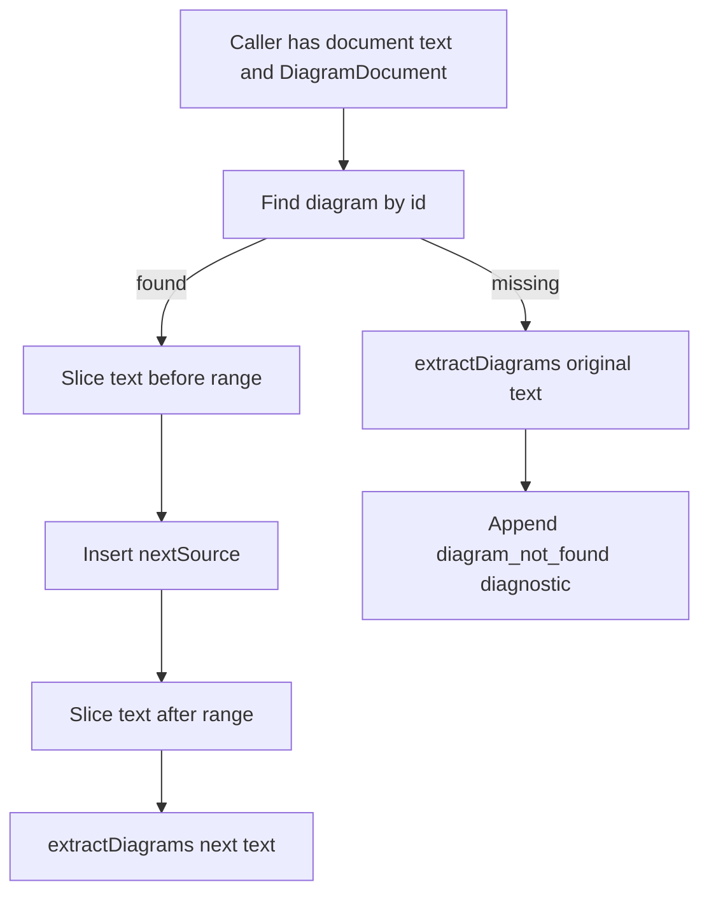

# diagram-source-map-contract design

## 0. 术语约定

- **Source range**：`SourceRange`，用 offset 和 line number 指向 document text 中可替换的 Mermaid 源码区域。
- **Fence content range**：Markdown fenced block 内部源码区域；替换时不包含 opening / closing fence。
- **Raw Mermaid block**：整份输入本身就是 Mermaid 源码时的图表块。
- **Safe replacement**：通过 `replaceDiagramSource(text, diagramId, nextSource, document)` 只替换目标 diagram block 的可替换源码范围，并返回重新抽取后的 document。

防冲突结论：仓库当前只有 MVP 级 `extractDiagrams`；roadmap 已定义 `replaceDiagramSource` 名称，本 feature 沿用该协议，不引入 diagnostics panel、repair engine 或 visual graph model。

## 1. 决策与约束

### 需求摘要

本 feature 从 `multi-diagram-live-editor` roadmap 的第二条起头。成功标准：document extractor 对 fenced block 和 raw Mermaid block 都给出可替换 `range`；fence 模式替换时保留 Markdown 上下文和 fence 标记；找不到 diagram id 时返回原文、重新抽取 document，并产生 `diagram_not_found` diagnostic。

明确不做：

- 不做 parse/layout/render 错误定位面板。
- 不做语法修复建议或一键修复。
- 不做 visual flowchart model、Mermaid serialize 或视觉编辑。
- 不做多图批量替换。
- 不新增 npm dependency。

### 复杂度档位

- 健壮性 = L2+：覆盖 Markdown fenced block、raw Mermaid block、无匹配 id 诊断；不承诺完整 Markdown parser。
- 结构 = module：继续放在 `src/editor/index.ts` 的 document-extractor 区域，当前文件规模仍可控。
- 可测试性 = tested：新增 unit tests 覆盖 range 可切片、replace 成功、replace missing id 和重新抽取。

### 关键决策

- `range.startOffset/endOffset` 使用 JS string offset，`endOffset` 为 exclusive。
- `startLine/endLine` 使用 1-based line number，`endLine` 指向 range 结束 offset 所在行。
- `DiagramBlock.source` 保持 trim 后源码，便于 UI 编辑；`range` 仍覆盖原文中的可替换内容，包括 fence 内原始缩进/空白。
- `replaceDiagramSource` 不信任外部旧 range，必须通过 `diagramId` 在传入 `document.diagrams` 中查找目标；替换后立即 `extractDiagrams(nextText)`。
- 找不到 id 时不抛错，返回原文和带 `diagram_not_found` diagnostic 的重新抽取 document。

### 前置依赖

`live-editor-static-mvp` 已完成并验收，提供 `extractDiagrams`、`DiagramDocument`、`DiagramBlock` 和静态 editor 基础。

## 2. 名词与编排

### 2.1 名词层

**现状**：

- `SourceRange` 已有 `startOffset/endOffset/startLine/endLine` 字段。
- `DiagramBlock.origin` 已区分 `markdown-fence` 与 `raw-mermaid-block`。
- `extractDiagrams` 已能抽取 fenced blocks 和纯 Mermaid 输入，但没有 replacement API。

**变化**：

- 强化 source range 语义：fenced block 的 range 指向 fence 内部源码区域；raw block 的 range 指向 trim 后源码在原文中的区域。
- 新增 `replaceDiagramSource(text, diagramId, nextSource, document)`。
- `src/index.ts` 导出 `replaceDiagramSource`。

接口示例：

```ts
const doc = extractDiagrams(markdownText);
const next = replaceDiagramSource(markdownText, doc.diagrams[0].id, 'graph TD\n  X --> Y', doc);
next.text; // markdown context and fences preserved
next.document.diagrams[0].source; // 'graph TD\n  X --> Y'
```

### 2.2 编排层



**现状**：selected source edits only render preview; no safe document replacement helper exists.

**变化**：

- `replaceDiagramSource` centralizes replacement semantics for future diagnostics, repair, export, and visual edit flows.
- Replacement uses `range.startOffset/endOffset` from the matched block and preserves all text outside that range.
- Missing diagram id returns original text and diagnostic rather than silently overwriting anything.

流程级约束：

- Replacement only modifies one selected diagram.
- Fence replacement must keep opening and closing fence lines unchanged.
- After replacement, returned document must be a fresh extraction from returned text.
- Missing id diagnostic uses `code: 'diagram_not_found'`, `severity: 'error'`, `range: null`.

### 2.3 挂载点清单

- `src/editor/index.ts`：新增 replacement API and range contract behavior.
- `src/index.ts`：导出 `replaceDiagramSource`.

本 feature 不新增 UI 按钮或 page controls；后续 feature 才会把 replacement 接入 source editor / repair / visual edit.

### 2.4 推进策略

1. Source range regression tests：覆盖 fenced content slice、raw Mermaid offsets、line numbers。
   退出信号：新增 tests 在当前实现上因 replacement/range contract 缺口失败。
2. Safe replacement tests：覆盖 fenced replacement、raw replacement、missing id diagnostic、fresh re-extraction。
   退出信号：红灯证明 API 不存在或行为未满足。
3. Extractor/range implementation：收紧 range helper 和 line calculation，保持既有 MVP tests。
   退出信号：source range tests passed。
4. Replacement API implementation：实现 `replaceDiagramSource` 并从 root export。
   退出信号：replacement tests passed。
5. 验证覆盖：运行 targeted tests、typecheck、release gate。
   退出信号：相关 tests 和 release verification passed。

### 2.5 结构健康度与微重构

##### 评估

- 文件级 — `src/editor/index.ts`：当前约 250 行，职责集中在 document extractor + live editor DOM class。本 feature 只在 extractor 合同周围新增小函数，不触碰 preview/runtime/repair 范围。
- 文件级 — `src/index.ts`：导出聚合点，新增一项 export 属于挂载点。
- 目录级 — `src/editor/`：目前只有一个文件；拆分 extractor 文件有价值但不是必要前置，避免在第二个 editor feature 就做结构搬迁。
- compound convention：`.codestable/compound` 无现有 convention 文档。

##### 结论：不做微重构

本 feature 的代码改动预计局部且可由测试守护。若后续 `preview-diagnostics-panel` 或 `visual-flowchart-model-v1` 继续扩张 `src/editor/index.ts`，再走独立 refactor 或在对应 design 中评估拆分 `src/editor/document.ts`。

## 3. 验收契约

关键场景：

- S1：fenced block 的 `range` 切片只覆盖 fence 内源码，不包含 opening/closing fence。
- S2：raw Mermaid 输入带前后空白时，`range` 指向 trim 后源码，替换后前后空白保留。
- S3：`replaceDiagramSource` 替换 fenced diagram 后，Markdown prose 和 fence 标记保持不变，returned document 重新抽取到新源码。
- S4：`replaceDiagramSource` 替换 raw Mermaid block 后，returned text 和 returned document 同步。
- S5：找不到 `diagramId` 时返回原文，不抛异常，并产生 `diagram_not_found` diagnostic。
- S6：替换第一张图不会改动同文档第二张图。

反向核对项：

- 不出现 diagnostics panel UI。
- 不出现 repair API。
- 不出现 export/share/hash API。
- 不出现 visual edit / graph model / serialize API。
- 不新增 npm dependency。

## 4. 与项目级架构文档的关系

验收阶段需要更新 `.codestable/architecture/ARCHITECTURE.md` 的当前静态 Live Editor MVP 段落：说明 document extractor 的 source range 已成为安全回写合同，并新增 `replaceDiagramSource` 作为后续 repair/visual edit 的共享入口。
