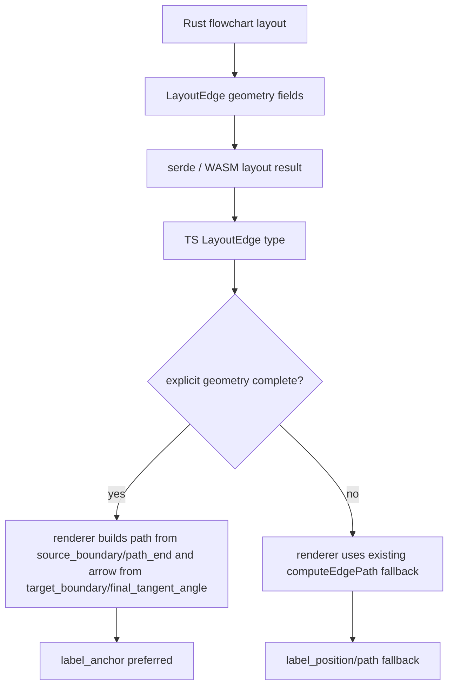

# edge-geometry-boundary-contract design

## 0. 术语约定

- **Edge Geometry Boundary Contract**：roadmap 第 4.4 节定义的 layout → renderer 显式边几何协议。
- **source_boundary**：edge 从源节点边界离开的点，不包含 renderer `edgeGap`。
- **target_boundary**：箭头尖端落在目标节点边界的点，不包含 renderer `edgeGap`。
- **path_end**：可见 stroke 结束点；有箭头时在 `target_boundary` 前方，避免 stroke 穿过箭头头部。
- **final_tangent_angle**：edge 末端切线角度，单位 radians，供箭头朝向使用。
- **label_anchor**：layout 给出的 label anchor；存在时 renderer 不再用 path fallback 推断 label 位置。
- **geometry_version**：当前协议版本，固定为 `1`。

## 1. 决策与约束

### 需求摘要

本 feature 在 Rust layout、TypeScript 类型和 SVG renderer 之间建立显式 edge geometry 字段。成功标准：Rust `LayoutEdge` 和 TS `LayoutEdge` 同步包含 roadmap 第 4.4 节字段；layout 产出的 JSON roundtrip 覆盖这些字段；renderer 在字段存在时优先使用 `target_boundary`、`path_end`、`final_tangent_angle`、`label_anchor`，字段缺失时继续走现有 `waypoints` fallback。

明确不做：

- 不做完整 routing 重写、障碍物避让、parallel edge bundling 或 port routing。
- 不删除现有 `waypoints` / `label_position` 兼容字段。
- 不改变 Mermaid 语法或 parser AST。
- 不改变主题 API 或箭头样式集合。
- 不让 renderer 依赖 Rust-only 逻辑；缺字段时仍能渲染旧 layout 数据。

### 复杂度档位

走“共享数据契约 + 渲染 fallback”档位。涉及 Rust layout 类型、TS 类型、SVG renderer 和测试，但不引入新模块或外部依赖。

### 关键决策

- `geometry_version` 作为 Rust layout 输出的非 optional 字段，当前固定为 `1`，用于后续版本化迁移；TS 接收侧保持 optional 以兼容旧 payload。
- Rust layout 先用现有 centerline waypoints 计算矩形边界级字段；本 feature 不复制 TS 的全部形状截断算法。非矩形 shape 的精准边界仍由后续 visual regression/routing 工作继续收紧。
- `path_end` 在 layout 中按默认 arrow footprint 计算，renderer 在字段存在时优先使用它；旧 layout 或缺字段仍走 `computeEdgePath` fallback。
- `label_anchor` 与现有 `label_position` 同步，renderer 优先级为 `label_anchor` → `label_position` → path fallback。
- renderer 新增一个小的显式几何路径构造分支，不删除 `computeEdgePath`。

## 2. 名词与编排

### 2.1 名词层

**现状**：

- Rust `LayoutEdge` 只有 `from`、`to`、`waypoints`、`label`、`label_position`、`style`。
- TS `LayoutEdge` 与 Rust 基本同构。
- SVG renderer 调用 `computeEdgePath`，在 renderer 端根据 node bounds/shape 推断 `arrowTip`、`pathEnd`、`arrowAngle` 和 fallback label。

**变化**：

- Rust `LayoutEdge` 增加：

```rust
pub source_boundary: Option<Point>,
pub target_boundary: Option<Point>,
pub path_end: Option<Point>,
pub final_tangent_angle: Option<f64>,
pub label_anchor: Option<Point>,
pub geometry_version: u8,
```

- TS `LayoutEdge` 增加同名字段：

```ts
source_boundary?: Point;
target_boundary?: Point;
path_end?: Point;
final_tangent_angle?: number;
label_anchor?: Point;
geometry_version?: 1;
```

TS 字段保持 optional，目的是让旧 WASM/mock layout payload 继续走 renderer fallback；Rust layout 正式输出时 `geometry_version` 固定为 `1`。

接口示例：

```json
{
  "from": "A",
  "to": "B",
  "waypoints": [{ "x": 100, "y": 60 }, { "x": 100, "y": 180 }],
  "source_boundary": { "x": 100, "y": 80 },
  "target_boundary": { "x": 100, "y": 160 },
  "path_end": { "x": 100, "y": 142 },
  "final_tangent_angle": 1.5707963267948966,
  "label_anchor": { "x": 100, "y": 120 },
  "geometry_version": 1
}
```

### 2.2 编排层



**现状**：renderer 是边界和箭头几何的主要计算者。

**变化**：layout 输出一组可消费的显式字段；renderer 只在字段缺失时继续推断。这样后续 Rust layout 可以逐步提供更精确的 shape/route 信息，而 SVG 层不需要重新猜测协议语义。

流程级约束：

- `target_boundary` 表示 arrow tip landing point，不包含 `edgeGap`。
- `path_end` 不得等同于 arrow tip，除非 edge style 无箭头或 edge 长度不足。
- `label_anchor` 存在时优先于 `label_position`。
- Rust 和 TS 字段必须同名，JSON roundtrip 必须覆盖字段存在性。
- renderer fallback 必须保留，旧 mock layout 和旧 WASM 输出仍可渲染。

### 2.3 挂载点清单

- `crates/xmermaid-layout/src/types.rs`：扩展 `LayoutEdge` 合同字段。
- `crates/xmermaid-layout/src/flowchart.rs`：产出 geometry v1 字段并随 back-edge shift 同步移动。
- `crates/xmermaid-layout/tests/roundtrip_test.rs`：验证 layout JSON roundtrip 保留 geometry 字段。
- `src/types/layout.ts`：同步 TS `LayoutEdge` 字段。
- `src/renderer/svg.ts`：renderer 优先消费显式几何字段。
- `tests/renderer.test.ts`：验证 renderer 使用 explicit geometry。

### 2.4 推进策略

1. 合同测试红灯：新增 Rust roundtrip 和 TS renderer 测试，先证明字段缺失和 renderer 未消费 explicit geometry。
   退出信号：`cargo test -p xmermaid-layout test_layout_edge_geometry_contract --test roundtrip_test` 或 renderer 目标测试失败于缺字段/未使用 explicit geometry。
2. Rust layout 合同：扩展 `LayoutEdge` 并在 flowchart layout 产出 geometry v1 字段。
   退出信号：Rust contract 测试通过。
3. TS 类型与 renderer 消费：同步 TS 字段，renderer 在完整 explicit geometry 存在时优先构造路径/箭头/label。
   退出信号：renderer explicit geometry 测试通过，旧 renderer fallback 测试仍通过。
4. 验证覆盖：运行 cargo tests、JS tests、typecheck、release gate、YAML 校验。
   退出信号：验证矩阵通过并可进入 acceptance。

### 2.5 结构健康度与微重构

##### 评估

- 文件级 — `crates/xmermaid-layout/src/flowchart.rs`：文件已较长，但本次只在现有 edge construction 区域补合同字段，不做 routing 重写。
- 文件级 — `src/renderer/svg.ts`：已有 `renderEdge` 集中处理路径/箭头/label，本次增加小 helper 以避免继续拉长主流程。
- 目录级 — `tests/` 与 `crates/xmermaid-layout/tests/`：已有对应测试文件，追加目标用例即可。
- compound convention：`.codestable/compound` 无相关 decision/trick/learning 文档。

##### 结论：不做微重构

本 feature 的改动集中在现有合同和消费点，先用小 helper 控制 `renderEdge` 复杂度。完整 routing/renderer 结构重划超出本 feature 范围。

## 3. 验收契约

关键场景：

- S1：`cargo test -p xmermaid-layout test_layout_edge_geometry_contract --test roundtrip_test` → layout JSON roundtrip 保留 `geometry_version=1` 和 geometry fields。
- S2：`npm test -- tests/renderer.test.ts` → renderer 在 explicit geometry 存在时使用 `path_end` / `target_boundary` / `final_tangent_angle` / `label_anchor`。
- S3：旧 layout 数据缺 explicit geometry → renderer fallback 测试仍通过。
- S4：`npm run typecheck` → TS `LayoutEdge` 合同字段类型正确。
- S5：`npm run verify:release` → build、JS tests、typecheck、cargo test、diff whitespace 全部通过。

反向核对项：

- 不删除 `waypoints` 或 `label_position`。
- 不修改 parser AST 或 Mermaid 语法。
- 不新增 npm/Rust dependency。
- 不提交 `.omx/`、`.codegraph/`、`screenshots/`、`dist/`、`pkg/`。

## 4. 与项目级架构文档的关系

acceptance 阶段需要把 Edge Geometry Boundary Contract 归并进 `.codestable/architecture/ARCHITECTURE.md` 的布局层/渲染层交互说明：layout 现在是 edge boundary/path-end/tangent/label-anchor 的合同来源，renderer 优先消费显式字段并保留 fallback。
