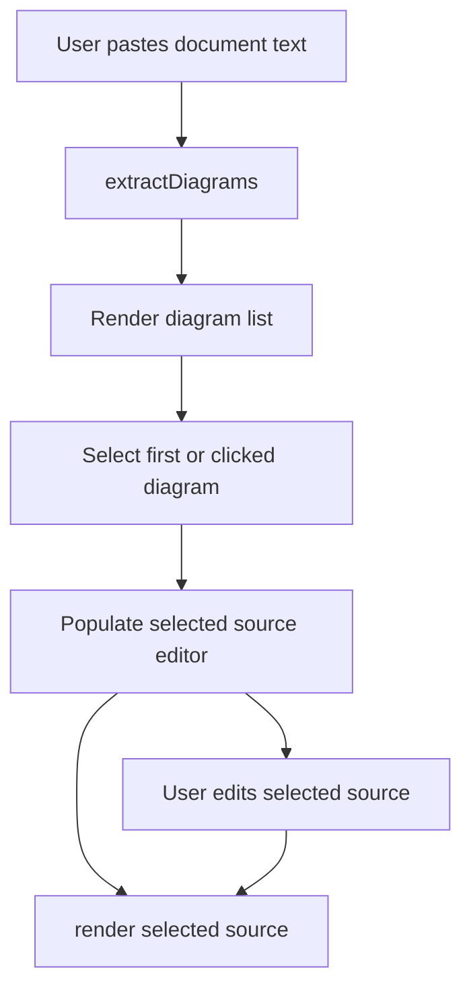

# live-editor-static-mvp design

## 0. 术语约定

- **Live editor static MVP**：无后端、无账号、无分享服务的浏览器端编辑预览工具。
- **Document text**：用户粘贴的完整文本，可以是纯 Mermaid，也可以是包含多个 Mermaid fenced block 的 Markdown。
- **Diagram block**：从 document text 中抽取出来的一段 Mermaid 源码。
- **Selected diagram**：当前在列表里选中的 diagram block；MVP 的编辑和预览只作用于它。
- **Preview runtime**：调用现有 `XMermaid.render()` 的浏览器端渲染流程。

防冲突结论：现有源码只有 `XMermaid` 单图渲染入口；架构文档提到 `XMermaidEditor` 构想但源码未实现。本 feature 使用 `XMermaidLiveEditor` 命名，避免和后续完整 Editor SDK 混淆。

## 1. 决策与约束

### 需求摘要

本 feature 从 `multi-diagram-live-editor` roadmap 的最小闭环起头。成功标准：用户能打开静态示例页面，粘贴一份包含多个 flowchart 的 Markdown/文本，系统自动抽取图表，展示图表列表，切换选中图表，在单独编辑区修改该图表源码，并实时渲染预览。

明确不做：

- 不做语法修复建议或一键修复。
- 不做 SVG/PNG 导出、复制、URL hash 分享。
- 不做视觉编辑和 Mermaid 反写。
- 不做完整 source map 安全回写到原文；MVP 只编辑 selected diagram 的独立源码。
- 不新增 npm 依赖或前端框架。

### 复杂度档位

- 健壮性 = L2 够用（偏离对外发布库默认 L3：这是静态 MVP，捕获预期渲染错误即可，完整诊断进入后续 `preview-diagnostics-panel`）。
- 结构 = modules（新增 `editor` 模块，避免继续膨胀 `src/xmermaid.ts`）。
- 可测试性 = tested（文档抽取和 UI 编排都要有 Vitest 覆盖）。

### 关键决策

- 文档抽取先支持 Markdown fenced code block 和纯 Mermaid/裸 Mermaid block 两类；更精确的 source range 与回写留给 `diagram-source-map-contract`。
- UI 不引入 React/Vue/Monaco；使用一个轻量 DOM class 组合 textarea、列表和 preview container。
- 渲染入口复用现有 `XMermaid.render()`，不新增 WASM API。
- `XMermaidLiveEditor` 提供可注入 `renderDiagram` 回调，测试和未来 preview-runtime 可以复用，不需要 mock WASM。

### 前置依赖

无。Roadmap 依赖已满足，`live-editor-static-mvp` 没有前置 item。

## 2. 名词与编排

### 2.1 名词层

**现状**：

- `src/xmermaid.ts` 的 `XMermaid.render(input)` 接收单段 Mermaid DSL 并把 SVG 写入一个 container。
- `src/index.ts` 导出单图渲染能力和 renderer helper。
- 仓库没有 document extractor、diagram list 或 live editor 状态类型。

**变化**：

- 新增 `DiagramBlock` / `DiagramDocument` / `extractDiagrams(text)`，承载 MVP 级文档抽取。
- 新增 `XMermaidLiveEditor`，接收 root/container，渲染静态编辑器 UI，并协调文档输入、图表列表、选中源码编辑和 preview render。
- `src/index.ts` 导出 live editor 和 extractor，作为公开入口的一部分。

接口示例：

```ts
// 来源：new editor module
const document = extractDiagrams(markdownText);
document.diagrams.map(d => d.source);

// 来源：new editor module
const editor = new XMermaidLiveEditor({
  root: document.getElementById('app')!,
  initialText: markdownText,
});
editor.mount();
```

### 2.2 编排层



**现状**：`examples/basic.html` 是单 textarea + render button；`XMermaid.render()` 每次只处理一段 DSL，没有多图列表或选中状态。

**变化**：

- app shell 启动时把 document textarea 的内容交给 `extractDiagrams()`。
- editor-state 保存 `documentText`、`diagramDocument`、`selectedDiagramId` 和 `selectedSource`。
- 图表列表点击更新 selected diagram，并把该 diagram source 放入 selected source textarea。
- selected source textarea 输入后 debounce-free 直接触发 render；MVP 不写回 document text。
- preview render 失败时显示错误文本，不抛到全局。

流程级约束：

- 无图表时列表为空，preview 显示空状态。
- 每次重新抽取文档后默认选中第一张图。
- Markdown fence 优先于裸 Mermaid 检测。
- 渲染失败只影响 preview 区，不清空 document 输入和 diagram list。

### 2.3 挂载点清单

- `src/index.ts`：新增 live editor / document extractor 导出。
- `examples/live-editor.html`：新增静态在线 MVP 入口。

本 feature 不新增 package exports 子路径；`xmermaid/editor` 留给后续完整 Editor SDK。

### 2.4 推进策略

1. 文档抽取计算节点：新增 extractor 类型和函数。
   退出信号：测试覆盖 Markdown 多 fence、纯 Mermaid 和无图表输入。
2. 编辑器编排骨架：新增 live editor DOM class，支持 mount、列表、选择和 selected source state。
   退出信号：测试可断言列表数量、默认选中和点击切换。
3. 预览接入：把 selected source 交给可注入 render callback，默认 callback 使用 `XMermaid.render()`。
   退出信号：测试可断言初次渲染和编辑后重新渲染；错误显示在 preview。
4. 静态页面入口：新增 `examples/live-editor.html`。
   退出信号：页面引用 dist bundle，包含文档输入、图表列表、源码编辑和预览容器。
5. 验证覆盖：运行 targeted tests、typecheck、release gate。
   退出信号：相关测试和 release verification 通过。

### 2.5 结构健康度与微重构

##### 评估

- 文件级 — `src/xmermaid.ts`：79 行，职责清晰为单图渲染入口；本 feature 不继续往其中塞 UI 编排。
- 文件级 — `src/index.ts`：10 行，导出聚合点；新增 export 属于挂载点。
- 目录级 — `src/`：当前同层已有 renderer/types/wasm/xmermaid 等入口，新增 editor 子目录比继续平铺多个 editor 文件更清晰。
- 目录级 — `tests/`：已有多个行为测试文件，本 feature 新增 focused editor tests，符合现状。
- compound convention：`.codestable/compound` 无现有 convention 文档。

##### 结论：不做微重构

本 feature 通过新增 `src/editor/` 模块隔离 UI 编排，不需要先拆迁现有文件。`src/renderer/svg.ts` 已超过 400 行但本 feature 不修改它；完整 renderer 结构治理不在本 feature 范围。

## 3. 验收契约

关键场景：

- S1：输入包含两个 ```mermaid fenced blocks → 图表列表显示两项，默认选中第一项并渲染第一张图。
- S2：点击第二个图表 → selected source textarea 切换为第二张图源码，并触发第二张图预览。
- S3：编辑 selected source → 触发实时预览，渲染使用编辑后的源码。
- S4：输入纯 Mermaid 文本（以 `graph` / `flowchart` 开头）→ 抽取为一张图。
- S5：输入无 Mermaid 内容 → 不抛异常，UI 显示无图表空状态。
- S6：渲染 callback 抛错 → preview 显示错误信息，文档输入和图表列表保留。

反向核对项：

- 不出现语法修复按钮或 repair API。
- 不出现导出、分享、URL hash API。
- 不出现 visual edit / graph model / serialize API。
- 不新增 npm dependency。

## 4. 与项目级架构文档的关系

验收阶段需要把应用层的 live editor static MVP 归并到 `.codestable/architecture/ARCHITECTURE.md`：说明当前应用层已有一个轻量 `XMermaidLiveEditor`，它组合 document extractor、editor state 和 preview runtime，但尚不是完整 Editor SDK，也不提供语法修复、分享导出或视觉编辑。
