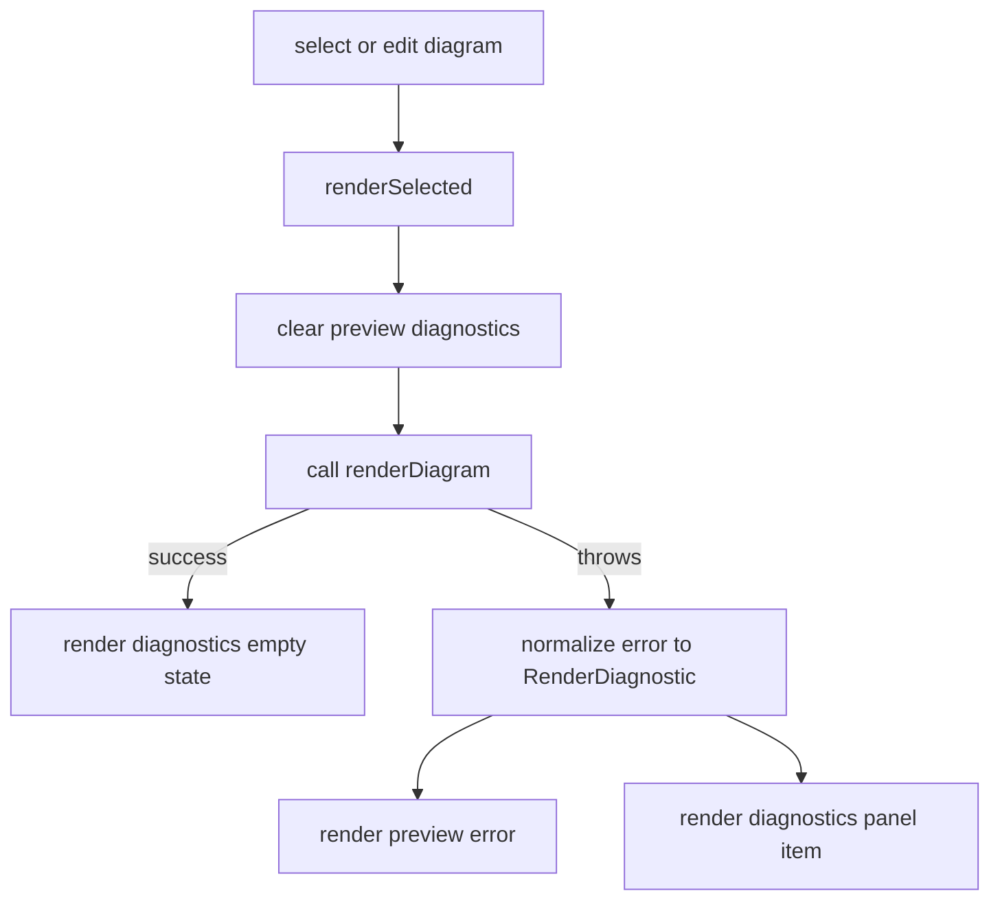

# preview-diagnostics-panel design

## 0. 术语约定

- **Render diagnostic**：preview runtime 对选中图表产生的 parse/layout/render/wasm/unsupported 错误记录。
- **Diagnostics panel**：静态 live editor UI 中展示 selected diagram diagnostics 的区域。
- **Selected range mapping**：诊断没有更精确 range 时，落到 selected diagram 的 `DiagramBlock.range`，用于告诉用户错误属于文档里的哪段图表。
- **Stale preview**：渲染失败时保留上一次成功 preview 的策略；本 feature 只保证 diagnostics 展示，不强制实现 stale preview 保留。

防冲突结论：已有 `DocumentDiagnostic` 用于文档抽取；本 feature 新增 `RenderDiagnostic` 表达 preview/runtime 错误，不引入 repair suggestion 或 parser-level source spans。

## 1. 决策与约束

### 需求摘要

本 feature 从 `multi-diagram-live-editor` roadmap 的第三条起头。成功标准：选中图表渲染失败时，错误进入结构化 diagnostics，而不是只显示一个 preview error 字符串；diagnostic 绑定 selected diagram 的 range；UI 展示错误 code、message 和 line range；切换图表或编辑源码会刷新 diagnostics。

明确不做：

- 不做语法修复建议或一键应用。
- 不做导出、分享、URL hash。
- 不做 visual flowchart model、视觉编辑或 Mermaid serialize。
- 不做完整 parser source-span 诊断；没有精确 span 时使用 selected diagram range。
- 不新增 npm dependency。

### 复杂度档位

- 健壮性 = L2：把现有 thrown errors / `XMermaidError` 规范化为 diagnostics；不承诺所有 WASM 错误都有精确类别。
- 结构 = module：继续放在 `src/editor/index.ts`，新增类型和小型 DOM panel。
- 可测试性 = tested：用 injected render callback 测试成功清空、失败显示、切换刷新和 line range 映射。

### 关键决策

- `LiveEditorRenderRequest` 保持注入点；render callback 可继续返回 `Promise<void>`。
- 新增 `RenderDiagnostic` 类型，字段与 roadmap 第 4.3 节对齐：`code`、`message`、`severity`、`range`。
- thrown `XMermaidError` 根据 `code` 映射为 `parse_error` / `layout_error` / `render_error` / `wasm_init_error` / `unsupported_diagram_type`；普通 `Error` 归一为 `render_error`。
- diagnostics panel 使用 `data-xm-diagnostics`，每条用 `data-xm-diagnostic-item`，便于测试和后续 UI 扩展。
- 成功渲染清空 diagnostics；无图表时显示无诊断空状态。

### 前置依赖

`diagram-source-map-contract` 已完成并验收，提供 selected diagram 的 authoritative `range`。

## 2. 名词与编排

### 2.1 名词层

**现状**：

- `renderSelected()` catch thrown error 后只在 preview 内写 `[data-xm-preview-error]` 文本。
- `DocumentDiagnostic` 已存在，但只服务 document/extractor。
- selected diagram 有 `range`，可作为 fallback mapping。

**变化**：

- 新增 `RenderDiagnostic` 和 `RenderDiagnosticCode`。
- `XMermaidLiveEditor` 维护当前 selected diagnostics，并渲染 diagnostics panel。
- `LiveEditorRenderRequest.diagram` 继续传入 selected `DiagramBlock`，错误归一化时使用它的 range。

接口示例：

```ts
const diagnostic: RenderDiagnostic = {
  code: 'parse_error',
  message: 'Unexpected token',
  severity: 'error',
  range: selectedDiagram.range,
};
```

### 2.2 编排层



**现状**：preview error is visible, but not structured and not mapped to document lines.

**变化**：

- `renderSelected()` sets diagnostics to empty before each render.
- On success, diagnostics panel shows no diagnostics.
- On failure, preview still shows the message, and diagnostics panel shows code/message/line range.
- Selecting another diagram or editing selected source reruns render and replaces diagnostics.

流程级约束：

- Diagnostics are scoped to selected diagram only.
- Missing selected diagram clears diagnostics.
- Diagnostic range defaults to selected diagram `range`; future parser spans may override this but are not part of this feature.
- Unsupported diagram type must not be reported as parse error when the thrown error is `XMermaidError('UNSUPPORTED_DIAGRAM', ...)`.

### 2.3 挂载点清单

- `src/editor/index.ts`：新增 render diagnostics types, normalization, panel DOM.
- `src/index.ts`：导出 `RenderDiagnostic` / `RenderDiagnosticCode` 类型。
- `examples/live-editor.html`：给 diagnostics panel 添加基础样式。

本 feature 不新增 toolbar buttons, repair controls, export/share controls, or visual editor controls.

### 2.4 推进策略

1. Diagnostics contract tests：新增 tests 覆盖 thrown render error maps to selected diagram range and panel item。
   退出信号：tests 在当前实现上因 diagnostics panel 缺失失败。
2. Selection/edit refresh tests：覆盖 success clears diagnostics and switching diagrams refreshes range。
   退出信号：tests 在当前实现上失败。
3. Diagnostics implementation：新增 types、normalize helper、panel DOM and state updates。
   退出信号：targeted tests passed。
4. Example styling：给 `examples/live-editor.html` 添加 minimal diagnostics styles。
   退出信号：HTML test or DOM query can find diagnostics region.
5. 验证覆盖：运行 targeted tests、typecheck、release gate。
   退出信号：相关 tests 和 release verification passed。

### 2.5 结构健康度与微重构

##### 评估

- 文件级 — `src/editor/index.ts`：职责仍集中在 static live editor，新增 diagnostics panel 会继续增加 DOM class 代码，但本 feature 的变更与 render orchestration 紧密相关。
- 文件级 — `examples/live-editor.html`：已有 inline CSS；新增 diagnostics 样式是示例页面职责。
- 目录级 — `src/editor/`：仍只有一个模块，暂不拆。
- compound convention：`.codestable/compound` 无现有 convention 文档。

##### 结论：不做微重构

本 feature 不先拆 `src/editor/index.ts`。如果下一条 `syntax-repair-rules-v1` 要继续扩大 editor 状态和 UI，再优先评估拆分 `diagnostics` / `document` / `shell` 模块。

## 3. 验收契约

关键场景：

- S1：渲染 callback 抛普通 `Error` → preview 显示错误，同时 diagnostics panel 显示 `render_error`、message 和 selected diagram line range。
- S2：渲染 callback 抛 `XMermaidError('PARSE_ERROR', ...)` → diagnostics panel 显示 `parse_error`，range 为 selected diagram range。
- S3：渲染成功后 diagnostics panel 清空错误状态。
- S4：点击第二个图表后若第二张渲染失败，diagnostic range 指向第二张图的 source range。
- S5：无图表输入时 diagnostics panel 显示无诊断状态，不抛异常。
- S6：unsupported diagram error maps to `unsupported_diagram_type`，不伪装成 parse error。

反向核对项：

- 不出现 repair suggestion 或 apply button。
- 不出现 export/share/hash API。
- 不出现 visual edit / graph model / serialize API。
- 不新增 npm dependency。

## 4. 与项目级架构文档的关系

验收阶段需要更新 `.codestable/architecture/ARCHITECTURE.md` 的当前静态 Live Editor MVP 段落：说明 preview diagnostics panel 已把 render errors 规范化为 `RenderDiagnostic` 并映射到 selected diagram range。
