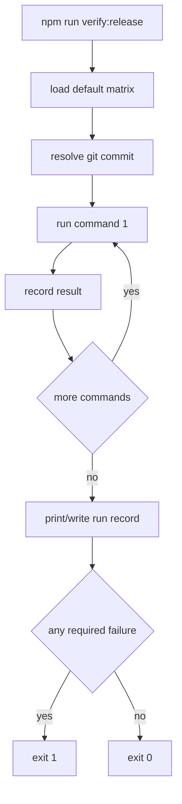

# release-verification-contract design

## 0. 术语约定

- **Verification Command Matrix**：发布前必须跑的命令集合。来自 roadmap 第 4.1 节，包含 `js-unit`、`ts-typecheck`、`rust-workspace`、`wasm-js-build`、`diff-whitespace`。
- **Verification Result Record**：每条命令的机器可读结果。来自 roadmap 第 4.2 节，字段包括 `checked_at`、`git_commit`、`command_id`、`command`、`exit_code`、`passed`、`summary`、`blocking_reason`。
- **release gate**：`npm run verify:release`。grep `verify:release` 未发现现有脚本冲突。
- **matrix-file**：供测试或临时诊断使用的 JSON 矩阵覆盖文件，不替代默认发布矩阵。

## 1. 决策与约束

### 需求摘要

本 feature 把发布验证从人工清单固化为一个 npm 脚本。成功标准：运行 `npm run verify:release` 会顺序执行 build、JS tests、TypeScript typecheck、Rust tests 和 whitespace diff check；每条命令都有机器可读结果；任一 required 命令失败时脚本 exit 非 0。

明确不做：

- 不新增 npm 依赖。
- 不引入 CI 配置。
- 不修改测试框架或现有测试语义。
- 不把验证结果默认写入仓库，避免每次运行污染工作区。
- 不治理 `.codestable/` / screenshots / `.codegraph/` 的提交策略；那属于 `codestable-evidence-governance`。

### 复杂度档位

走“单仓库发布脚本”默认档位，无服务端、并发执行、持久化数据库或 UI。

### 关键决策

- 使用 Node `.cjs` 脚本实现 release gate，保持与 `scripts/build-wasm.cjs` 同风格。
- 默认矩阵顺序使用 `npm run build` 在前，防止再次出现 test/typecheck 绿但 build 漏跑。
- 运行所有矩阵命令而不是首个失败即退出，以便一次输出完整阻塞面。
- 默认人类可读输出；`--json` 输出机器可读 JSON；`--output <path>` 可选写文件。

## 2. 名词与编排

### 2.1 名词层

**现状**：

- `package.json` 只有分散脚本：`build`、`test`、`typecheck`。
- Rust tests 通过 `cargo test` 手动运行，不在 npm release gate 中。
- 没有统一的 verification result record。

**变化**：

- 新增 `scripts/verify-release.cjs`。
- 新增 `package.json` script：`verify:release` → `node scripts/verify-release.cjs`。
- 新增 `tests/verify-release.test.ts`，用 `--matrix-file` 验证结果 schema、失败 exit code 和 blocking reason。

接口示例：

```bash
# 来源：package.json scripts.verify:release
npm run verify:release
# 正常：所有 required 命令通过，exit 0，stdout 打印 summary
# 失败：任一 required 命令失败，exit 1，summary 标出 blocking command

node scripts/verify-release.cjs --json --output /tmp/verification.json
# 输出 VerificationRunRecord JSON，同时写入指定路径
```

核心类型：

```ts
interface VerificationCommand {
  id: VerificationCommandId;
  command: string;
  required_for_release: boolean;
  failure_owner: 'toolchain' | 'code' | 'test-fixture' | 'unknown';
}

interface VerificationResultRecord {
  checked_at: string;
  git_commit: string;
  command_id: VerificationCommandId;
  command: string;
  exit_code: number;
  passed: boolean;
  summary: string;
  blocking_reason: string | null;
}
```

### 2.2 编排层



**现状**：验证命令靠人工并行/顺序执行，结果只存在聊天记录或临时输出中。

**变化**：验证入口集中到 `verify:release`。脚本按矩阵顺序运行并记录每条结果；失败不阻止后续命令执行；最终根据 required failure 决定 exit code。

流程级约束：

- `npm run build` 是默认矩阵第一条。
- 每条结果必须包含 `git_commit` 和同一次运行的 `checked_at`。
- `passed=false` 时 `blocking_reason` 必填。
- `--matrix-file` 只改变本次脚本输入，不修改默认矩阵。

### 2.3 挂载点清单

- `package.json` scripts：新增 `verify:release`。
- `scripts/verify-release.cjs`：新增发布验证入口。

### 2.4 推进策略

1. 脚本骨架：新增默认矩阵、CLI 参数解析、summary 输出。
   退出信号：`node scripts/verify-release.cjs --matrix-file <fake>` 能读取矩阵并输出记录。
2. 命令执行与结果 schema：顺序运行矩阵，生成每条 `VerificationResultRecord`。
   退出信号：单测验证通过/失败命令都被记录，失败含 blocking reason。
3. npm 挂载：新增 `verify:release`。
   退出信号：`npm run verify:release` 运行默认矩阵。
4. 验证覆盖：跑 release gate 与现有测试。
   退出信号：`npm run verify:release`、`npm test`、`git diff --check` 和 YAML 校验通过。

### 2.5 结构健康度与微重构

##### 评估

- 文件级 — `package.json`：只新增一条 script，不需要拆。
- 文件级 — `scripts/build-wasm.cjs`：不修改，仅作为风格参考。
- 目录级 — `scripts/`：当前只有 1 个文件，本次新增 1 个，不触发摊平。
- 目录级 — `tests/`：当前 5 个测试文件，本次新增 1 个，不触发摊平。
- compound convention：`.codestable/compound` 无相关 decision/trick/learning 文档。

##### 结论：不做微重构

本 feature 新增独立脚本和独立测试，不需要拆分现有文件或重组目录。

## 3. 验收契约

关键场景：

- S1：运行 `node scripts/verify-release.cjs --matrix-file <含一条成功一条失败的 fake matrix> --json` → exit 1，JSON 中两条结果都存在，失败项 `blocking_reason` 非空。
- S2：运行 `npm run verify:release` → 顺序运行默认发布矩阵，所有 required 命令通过时 exit 0。
- S3：运行 `npm test` → 包含 `tests/verify-release.test.ts` 且全量 JS 测试通过。
- S4：运行 `git diff --check` → 无 whitespace error。

反向核对项：

- 不新增 npm dependency。
- 不修改 Rust 源码。
- 不默认写验证结果到仓库路径。

## 4. 与项目级架构文档的关系

本 feature 是发布/验收工具链能力，不改变 runtime parser/layout/renderer 架构。acceptance 阶段不需要更新 `ARCHITECTURE.md`，但应把 `verify:release` 作为后续 CodeStable acceptance 可引用的验证入口记录在本 feature 验收报告中。
