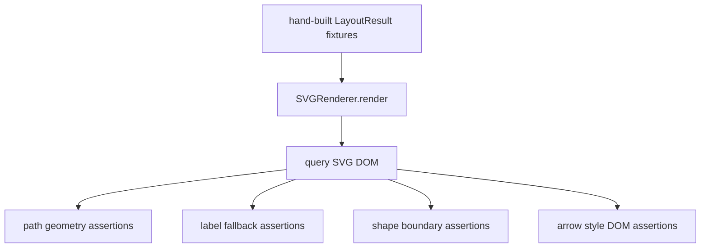

# svg-geometry-regression-suite design

## 0. 术语约定

- **SVG geometry regression suite**：针对 renderer 输出的 SVG path/label/arrow/shape boundary 行为的可重复测试集合。
- **complex path**：多 waypoint 或跨 rank edge 产生的非单线段路径。
- **label fallback**：edge 缺 `label_anchor` / `label_position` 时，renderer 根据最终 path geometry 计算 label 位置。
- **shape boundary**：非矩形 node shape 的边界截断点，例如 diamond/circle/stadium。
- **visual evidence**：截图或视觉基线资产，按 `docs/evidence-governance.md` 默认不提交。

## 1. 决策与约束

### 需求摘要

本 feature 补强 SVG 几何回归测试，覆盖复杂 path、label fallback、shape boundary 和 arrow styles。成功标准：新增测试文件能在 jsdom 下验证实际 SVG DOM；不引入截图 baseline；如果测试暴露真实渲染缺陷，则只做最小 renderer 修复。

明确不做：

- 不提交 `screenshots/**` 或新视觉图片基线。
- 不引入 Playwright、pixel diff 或新 npm dependency。
- 不改 Rust layout routing 算法。
- 不扩展 Mermaid 语法。
- 不重构 renderer 文件结构。

### 复杂度档位

走“测试覆盖增强”档位。主要改动在 Vitest 测试；生产代码只在新 regression 暴露真实缺陷时局部修复。

### 关键决策

- 新增 `tests/svg-geometry-regression.test.ts`，不把用例塞进已有 `renderer.test.ts`，避免基础 renderer smoke tests 继续膨胀。
- 使用 DOM 断言检查 SVG path、text、shape、arrow element，而不是截图；截图后续如要提交，必须先升级为 baseline/fixture 路径。
- 对 arrow styles 采用参数化测试，保证 `filled`/`triangle`/`open`/`circle`/`cross` 的 DOM 形态不回退。
- 对 shape boundary 用 renderer path `d` 的起止坐标断言，覆盖 diamond/circle/stadium 不被误当矩形边界。

## 2. 名词与编排

### 2.1 名词层

**现状**：

- `tests/edge.test.ts` 已覆盖底层 `truncateAtBounds`、path helpers 和少量 arrow point 计算。
- `tests/renderer.test.ts` 已覆盖基本 SVG、基础 arrow styles、line edge 不画 arrow、一个 label fallback 场景和 explicit geometry consumption。
- 缺少把复杂 layout 输入渲染成 SVG DOM 后的组合回归测试。

**变化**：

- 新增 `tests/svg-geometry-regression.test.ts`，直接构造 `LayoutResult` 并通过 `SVGRenderer.render()` 断言 DOM。
- 覆盖：
  - multi-waypoint straight path 保留中间 routing point 且 path end 不进入 target node；
  - label fallback 使用最终 visible path geometry；
  - diamond/circle/stadium shape boundary 截断点不落进 node interior；
  - 每种 arrow style 的 DOM element shape 稳定；
  - `screenshots/` 仍按 evidence governance 被 ignore，不作为本 feature 资产。

接口示例：

```bash
npm test -- tests/svg-geometry-regression.test.ts
# 正常：所有 SVG geometry regression 通过，不生成截图文件
```

### 2.2 编排层



**现状**：底层 helper 和基础 DOM smoke tests 分散存在，缺少组合用例。

**变化**：新增 regression suite 作为 renderer 行为安全网，不改变 runtime 编排。

流程级约束：

- 测试不得生成或提交 `screenshots/**`。
- 测试必须断言实际 SVG DOM，而不是只测 helper return value。
- 发现真实缺陷时只修对应 renderer/helper 行为，不顺手做 routing 重写。

### 2.3 挂载点清单

- `tests/svg-geometry-regression.test.ts`：新增 SVG geometry regression suite。
- 生产代码挂载点：默认无；若新测试暴露缺陷，只允许触碰 `src/renderer/svg.ts` 或 `src/renderer/edge.ts` 中对应最小逻辑。

### 2.4 推进策略

1. regression 测试：新增复杂 path、label fallback、shape boundary、arrow style DOM 用例。
   退出信号：`npm test -- tests/svg-geometry-regression.test.ts` 跑出明确 pass/fail。
2. 最小修复（按需）：如果 regression 失败，定位并修正最小 renderer/helper 行为。
   退出信号：新增 regression 测试通过，旧 renderer/edge 测试仍通过。
3. 验证覆盖：运行 targeted tests、全量 release gate、YAML 校验和 status hygiene。
   退出信号：验证矩阵通过，roadmap/checklist 可进入 acceptance。

### 2.5 结构健康度与微重构

##### 评估

- 文件级 — `tests/renderer.test.ts`：已有基础 renderer smoke tests，继续追加会混杂 regression intent。
- 目录级 — `tests/`：已有多个测试文件；新增一个专用 regression file 更清晰。
- 生产代码：默认不改；若必须修，只做局部最小变更。
- compound convention：`.codestable/compound` 无相关 decision/trick/learning 文档。

##### 结论：不做微重构

本 feature 是测试覆盖增强，不重组 renderer 或 tests 目录。

## 3. 验收契约

关键场景：

- S1：`npm test -- tests/svg-geometry-regression.test.ts` → 复杂 path、label fallback、shape boundary、arrow styles 全部通过。
- S2：`npm test -- tests/edge.test.ts tests/renderer.test.ts tests/svg-geometry-regression.test.ts` → 旧底层/renderer 覆盖不回退。
- S3：`npm run verify:release` → build、JS tests、typecheck、cargo test、diff whitespace 全部通过。
- S4：`git status --short` → 不出现 `screenshots/`、`.codegraph/`、`.omx/`、根目录 `cdp-*`。
- S5：checklist 和 roadmap items YAML 校验通过。

反向核对项：

- 不提交 screenshot/ad hoc visual evidence。
- 不新增 npm/Rust dependency。
- 不修改 Rust layout routing 或 parser AST。
- 不重构 renderer 文件结构。

## 4. 与项目级架构文档的关系

本 feature 不改变 runtime 架构；它把 SVG geometry 行为变成测试守护。acceptance 阶段只需在架构文档中确认 renderer 的 edge geometry contract 已有 regression suite 覆盖，不需要新增模块结构。
