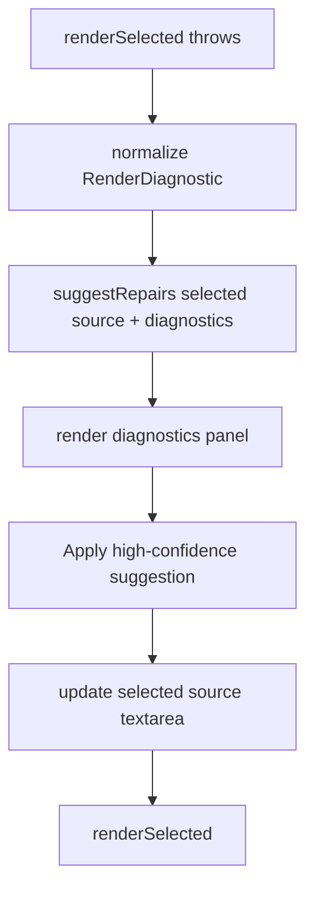

# syntax-repair-rules-v1 design

## 0. 术语约定

- **Repair suggestion**：确定性修复建议，含 `id`、`title`、`confidence`、`range`、`before`、`after`、`reason`。
- **Repair engine**：纯函数模块，输入 selected source 和 render diagnostics，输出 repair suggestions。
- **High-confidence repair**：可一键应用的修复；v1 UI 只渲染 high-confidence 的 apply button。
- **Unsupported hint**：对不支持图表类型给出提示，但不生成伪修复。

防冲突结论：roadmap 已定义 `suggestRepairs` / `applyRepair` 名称。本 feature 按该协议新增 `src/editor/repair.ts`，避免继续把规则逻辑塞进 `XMermaidLiveEditor` DOM class。

## 1. 决策与约束

### 需求摘要

本 feature 从 `multi-diagram-live-editor` roadmap 的第四条起头。成功标准：render diagnostics 出现时，repair engine 对高置信语法问题生成可 diff 的修复建议；static live editor 展示建议并支持一键应用到 selected source，然后重新触发 preview。

明确不做：

- 不接 LLM 或网络修复。
- 不支持低置信自动应用。
- 不做导出、分享、URL hash。
- 不做 visual flowchart model、视觉编辑或 Mermaid serialize。
- 不承诺保留用户原始 Mermaid 格式；只替换 selected source。
- 不新增 npm dependency。

### 复杂度档位

- 健壮性 = L2：覆盖 roadmap 指定的高置信规则；其它错误返回空建议或 unsupported hint。
- 结构 = modules：新增 `src/editor/repair.ts` 纯函数模块；`src/editor/index.ts` 只负责调用和渲染。
- 可测试性 = tested：repair engine 单测 + editor UI apply flow 单测。

### 关键决策

- `suggestRepairs(source, diagnostics)` 只在存在 diagnostics 时生成建议，避免在正常输入上猜测。
- v1 高置信规则：
  - 缺少 `graph TD` / `flowchart TD`：source 含 edge 语法但第一行不是 graph/flowchart header。
  - 常见方向拼写错误：`TDD` → `TD`、`TDB` → `TB`、`LEFT` → `LR`、`RIGHT` → `RL`。
  - 常见箭头 typo：`=>` / `==>` → `-->`。
  - 未闭合 label 括号简单情况：行内 `A[Label --> B` 修为 `A[Label] --> B`。
- unsupported diagram type 只生成 `confidence: low` 的 unsupported hint，UI 不展示 apply button。
- `applyRepair(source, suggestion)` 只在 source 中找到 exact `before` 片段时替换第一处；找不到则返回原 source。
- UI 一键应用只更新 selected source textarea，不回写 document text；安全回写到原文留给后续 visual/repair integration。

### 前置依赖

`preview-diagnostics-panel` 已完成并验收，提供 `RenderDiagnostic` 和 selected range mapping。

## 2. 名词与编排

### 2.1 名词层

**现状**：

- `RenderDiagnostic` 已存在，diagnostics panel 能显示 render errors。
- `XMermaidLiveEditor` 能在 selected source 编辑后重新渲染。
- 仓库没有 repair engine 或 repair UI。

**变化**：

- 新增 `RepairSuggestion` / `RepairConfidence` 类型。
- 新增 `suggestRepairs(source, diagnostics)` 和 `applyRepair(source, suggestion)`。
- `XMermaidLiveEditor` 在 render failure 后调用 `suggestRepairs`，并在 diagnostics panel 中展示 high-confidence apply button。
- `src/index.ts` 导出 repair API 和类型。

接口示例：

```ts
const suggestions = suggestRepairs('A ==> B', diagnostics);
const nextSource = applyRepair('A ==> B', suggestions[0]);
```

### 2.2 编排层



**现状**：diagnostics panel shows errors but no repair suggestions.

**变化**：

- Failure path stores current diagnostics and suggestions for rendering.
- Suggestions are rendered under diagnostics; high-confidence suggestions get apply buttons.
- Applying a suggestion replaces selected source with `applyRepair` result and reruns render.

流程级约束：

- Repair suggestions are scoped to selected source only.
- Suggestions must include `before` and `after`, making the change diffable.
- Low/medium confidence suggestions are visible as text only or hidden from apply; v1 UI only applies high confidence.
- Unsupported diagram diagnostic cannot produce a fake source rewrite.

### 2.3 挂载点清单

- `src/editor/repair.ts`：repair types and pure functions.
- `src/editor/index.ts`：suggestion rendering and apply event.
- `src/index.ts`：export repair API/types.
- `examples/live-editor.html`：repair suggestion styles.

### 2.4 推进策略

1. Repair engine RED tests：missing header, direction typo, arrow typo, unclosed label, unsupported hint, apply exact replacement。
   退出信号：tests fail because repair module/API does not exist.
2. Editor UI RED tests：render failure shows high-confidence suggestion and apply updates selected source + rerenders。
   退出信号：tests fail because repair UI does not exist.
3. Repair engine implementation：new `src/editor/repair.ts` with deterministic rules.
   退出信号：repair engine tests passed.
4. Editor integration：call `suggestRepairs`, render suggestions, apply high-confidence repair.
   退出信号：editor UI tests passed.
5. 验证覆盖：targeted tests、typecheck、release gate、browser happy path.
   退出信号：相关 tests 和 release verification passed。

### 2.5 结构健康度与微重构

##### 评估

- 文件级 — `src/editor/index.ts`：已承担 extractor、replacement、diagnostics 和 DOM editor；repair rules 若继续塞入会混杂计算与 UI。
- 文件级 — `src/editor/repair.ts`：新增纯函数模块，承载 repair-engine 规则。
- 目录级 — `src/editor/`：从单文件进入多文件是合理边界，不需要搬迁现有代码。
- compound convention：`.codestable/compound` 无现有 convention 文档。

##### 结论：做小型结构分离（新增文件，不搬旧代码）

新增 `src/editor/repair.ts` 承载 deterministic repair rules；不移动现有 extractor/editor 代码。验证方式：repair engine 单测、editor integration tests、typecheck。

## 3. 验收契约

关键场景：

- S1：source 缺少 graph/flowchart header 且有 edge 语法 → high-confidence suggestion 添加 `flowchart TD`。
- S2：header 方向拼写错误 → high-confidence suggestion 修为合法方向。
- S3：常见 arrow typo → high-confidence suggestion 修为 `-->`。
- S4：简单未闭合 label bracket → high-confidence suggestion 补 `]`。
- S5：unsupported diagram diagnostic → 只给 low-confidence unsupported hint，不提供一键 apply。
- S6：点击 high-confidence apply button → selected source 更新并重新 render。

反向核对项：

- 不接 LLM / 网络。
- 不实现导出、分享、URL hash。
- 不实现 visual edit / graph model / serialize API。
- 不新增 npm dependency。

## 4. 与项目级架构文档的关系

验收阶段需要更新 `.codestable/architecture/ARCHITECTURE.md` 的当前静态 Live Editor MVP 段落：说明 repair engine 是本地 deterministic rules，`suggestRepairs` / `applyRepair` 只作用于 selected source，LLM repair 不属于当前系统事实。
