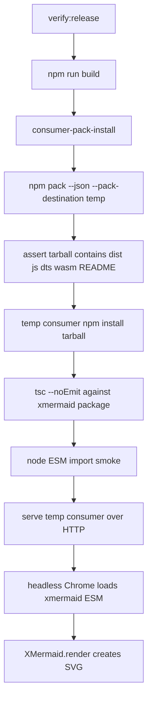

# pack-install-render-smoke design

## 0. 术语约定

- **Consumer smoke gate**：从 packed tarball 新建临时消费者项目，执行安装、类型解析、JS import 和真实浏览器渲染的发布门禁。
- **Packed tarball**：`npm pack` 产物，不是当前仓库源码目录。该 gate 只信 tarball 内实际文件。
- **Browser render smoke**：由 headless Chrome 加载消费者项目中的 ESM bundle 与 WASM asset，并渲染最小 flowchart 后检查 DOM 中存在 SVG。

## 1. 决策与约束

### 需求摘要

本 feature 是 production-readiness roadmap 的最小闭环：证明用户拿到 npm tarball 后能安装、TypeScript 能解析公开类型、浏览器能加载 WASM 并渲染最小 flowchart。

成功标准：

- release verification 默认矩阵包含 consumer smoke gate，且在 build 后执行。
- consumer smoke 使用 `npm pack` 的真实 tarball，不从 `src/` 或仓库根入口 import。
- 临时消费者项目安装 tarball 后，`tsc --noEmit` 能解析 root public API 类型。
- 真实浏览器加载消费者项目下的 package ESM bundle，初始化 WASM 并渲染 `graph TD\n  A-->B` 为 SVG。
- smoke 输出包含 package size 与 browser render duration，供 release 记录留痕。

明确不做：

- 不新增 Playwright/Puppeteer 等 dev dependency；使用系统 Chrome 和 Node 内置 HTTP server。
- 不实现新的 public render API；仍使用现有 `new XMermaid({ container }).render(input)`。
- 不新增 diagram type、diagnostics 或 security policy。
- 不发布、不上传 npm、不改版本号。
- 不把 jsdom 当作 browser smoke 的替代品。

### 复杂度档位

走“发布门禁脚本”档位。偏离点：该脚本执行真实外部命令和真实浏览器，必须给出清晰失败诊断，并避免把生成 tarball 留在仓库根目录。

### 关键决策

- **D1：consumer smoke 默认必须跑真实 Chrome。** 没有 Chrome 就失败并提示 `CHROME_BIN`，不静默降级到 jsdom。
- **D2：`npm pack` 输出放到临时目录。** 避免 release gate 在仓库根留下 `xmermaid-*.tgz` 垃圾文件。
- **D3：TypeScript gate 使用消费者项目的 `node_modules/xmermaid`。** 测的是 packed declarations 和 exports，不测仓库源码。
- **D4：release matrix 用 `npm run --silent smoke:consumer -- --json`。** JSON stdout 让 `verify-release` 能把 package size / render duration 合入 summary。

### 前置依赖

roadmap item `release-support-matrix` 已完成，提供 root public API 中的 support matrix 导出；本 feature 的 typecheck smoke 必须覆盖这些新导出，防止 `dist/*.d.ts` 继续陈旧。

## 2. 名词与编排

### 2.1 名词层

#### 现状

- `scripts/verify-release.cjs` 默认矩阵只跑 build、unit、typecheck、cargo test 和 whitespace；没有 packed consumer gate。
- `package.json` 没有直接运行消费者 smoke 的 npm script。
- `dist/` 是发布入口，但仓库内 `npm test` / `tsc --noEmit` 不证明 `dist/index.d.ts`、`dist/support.d.ts`、WASM asset 都会进入 tarball。
- 当前浏览器渲染路径依赖 `dist/xmermaid.esm.js` 中的 `import.meta.url` 去定位 `xmermaid_wasm_bg.wasm`。
- 当前 root ESM bundle 不应在模块加载期访问 `document`；否则 Node/SSR/构建工具解析包入口时会在真正渲染前崩溃。

#### 变化

新增 consumer smoke 脚本：

```ts
// 来源：新增 scripts/consumer-smoke.cjs
interface ConsumerSmokeRecord {
  passed: boolean;
  package_name: string;
  package_version: string;
  package_size_bytes: number;
  browser_render_duration_ms: number;
  checks: Array<{
    id: 'npm-pack' | 'pack-files' | 'consumer-install' | 'typecheck' | 'node-import' | 'browser-render';
    passed: boolean;
    summary: string;
  }>;
  summary: string;
}
```

新增 npm script：

```json
{
  "scripts": {
    "smoke:consumer": "node scripts/consumer-smoke.cjs"
  }
}
```

release matrix 新增命令：

```json
{
  "id": "consumer-pack-install",
  "command": "npm run --silent smoke:consumer -- --json",
  "required_for_release": true,
  "failure_owner": "packaging"
}
```

### 2.2 编排层



#### 现状

发布验证只证明当前工作树能 build/test/typecheck。它不会发现 tarball 少了 declaration 文件、exports 指向不存在文件、WASM asset 没被复制进 `dist/`、或浏览器无法按 package 路径加载 WASM。

#### 变化

- `verify-release` 支持列出默认矩阵，测试可直接约束 production gate 是否在矩阵中。
- 默认矩阵在 build 后增加 `consumer-pack-install`。
- `consumer-smoke` 生成临时消费者项目，只通过 installed package 使用 `xmermaid`。
- 浏览器 smoke 通过本机 headless Chrome 访问临时 HTTP server，使用 import map 指向 `/node_modules/xmermaid/dist/xmermaid.esm.js`。
- Node import smoke 只证明 root ESM 可被 Node/SSR/构建工具解析，不承诺在 Node 环境渲染 DOM。

流程级约束：

- smoke 脚本失败时退出非 0，并输出 `[xmermaid consumer-smoke diagnostic] ...`。
- 无 Chrome 时失败，不降级。
- 临时目录默认自动清理；用户传 `--keep-temp` 才保留。
- `verify-release --list-matrix --json` 不执行命令，只输出矩阵。
- package size 和 browser render duration 只记录基线，本 feature 不设硬阈值。

### 2.3 挂载点清单

- release verification：`scripts/verify-release.cjs` — 默认矩阵新增 consumer gate，并支持 list-matrix 供测试和人工检查。
- release smoke script：`scripts/consumer-smoke.cjs` — 新增真实 packed consumer gate。
- package scripts：`package.json` — 新增 `smoke:consumer` 命令。
- tests：release matrix 和 smoke helper 行为测试，防止门禁被删。

### 2.4 推进策略

1. RED 测试：新增 release matrix / consumer smoke helper 测试，先确认失败。
   退出信号：测试因 `--list-matrix` 不存在或 `consumer-smoke.cjs` 不存在失败。
2. 编排骨架：实现 `consumer-smoke.cjs` 的 pack、manifest 校验、临时消费者安装和 JSON 记录。
   退出信号：smoke helper 测试通过，脚本 `--help` 可用。
3. 计算节点：接入 typecheck、Node import、HTTP server 和 Chrome browser render smoke。
   退出信号：`npm run smoke:consumer -- --json` 在 build 后通过。
4. release 挂载：更新 `verify-release` 默认矩阵、summary 解析和 package script。
   退出信号：release script 测试通过，`verify-release --list-matrix --json` 显示 consumer gate。
5. 回归验证：跑相关单测、全量 JS 测试、typecheck、build、consumer smoke。
   退出信号：验证命令全部通过。

### 2.5 结构健康度与微重构

##### 评估

- 文件级 — `scripts/verify-release.cjs`：当前职责就是 release matrix runner；新增 list-matrix 和一个默认命令属于原职责，不需要拆分。
- 文件级 — `package.json`：只新增 npm script，不调整依赖或发布版本。
- 目录级 — `scripts/`：已有 build/verify/copy 脚本，新增 consumer smoke 保持发布工具集中，不需要新目录。
- 测试级 — 现有 `tests/verify-release.test.ts` 已覆盖 release runner；新增 matrix 测试可放同文件。consumer smoke helper 测试可独立成 `tests/consumer-smoke.test.ts`，避免 release runner 测试过胖。

##### 结论：不做微重构

本 feature 的稳定边界是一个独立 release script 加一个矩阵挂载点。拆公共 command runner 或引入浏览器自动化库会扩大范围；先保持脚本内聚，后续若 release scripts 继续增长再走 `cs-refactor`。

## 3. 验收契约

关键场景：

- **S1**：运行 `node scripts/verify-release.cjs --list-matrix --json` → 输出默认矩阵，`consumer-pack-install` 在 `wasm-js-build` 之后且 required。
- **S2**：运行 consumer smoke helper 测试 → pack manifest 校验要求 `dist/index.d.ts`、`dist/support.d.ts`、ESM/CJS bundle、WASM asset 和 README。
- **S3**：运行 `npm run build && npm run smoke:consumer -- --json` → packed tarball 安装进临时消费者，typecheck、Node import 和 browser render 全通过。
- **S4**：browser smoke 成功时 → JSON summary 记录 package size 与 browser render duration。
- **S5**：无 Chrome 环境时 → smoke gate 失败并提示 `CHROME_BIN`，不报告通过。

反向核对项：

- 不新增 Playwright/Puppeteer 或其他依赖。
- 不新增 render API 或更改 `XMermaid.render()` 行为。
- 不新增 diagram/parser/renderer 能力。
- 不把 smoke tarball 留在仓库根目录。

## 4. 与项目级架构文档的关系

本 feature 新增生产发布门禁能力。acceptance 阶段需要把 `consumer-pack-install` 作为 release verification 的当前事实写入 `ARCHITECTURE.md` 的生产支持 / 发布验证相关位置，并更新 `production-support-contract` requirement 的当前能力边界。
