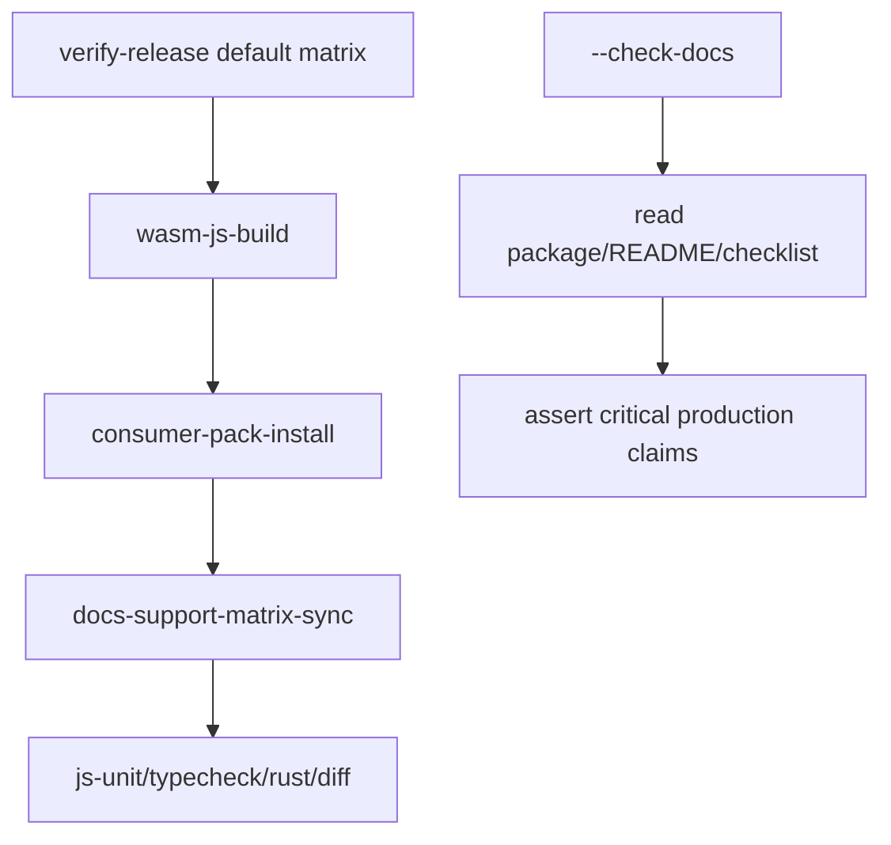

# production-docs-release-checklist design

## 0. 术语约定

- **Production docs**：面向包消费者的 README 与 `docs/production-release-checklist.md`，不是 CodeStable 内部规划文档。
- **Docs sync gate**：release verifier 中的文档一致性检查，确保 README / package metadata / support matrix / release checklist 不互相打架。
- **Release checklist**：发布前维护者必须跑的命令、环境要求和失败处理说明。

## 1. 决策与约束

### 需求摘要

当前代码已经有 support matrix、packed consumer smoke、SVG API、structured diagnostics 和 security policy，但 README 仍是草稿级，release verifier 也没有检查文档同步。生产落地需要让消费者知道怎么安装、怎么加载 WASM、如何处理 diagnostics、默认安全策略是什么，以及维护者发布前必须跑哪些 gate。

成功标准：

- README 覆盖安装、browser usage、SVG element/string API、support matrix、diagnostics、安全策略、WASM/Chrome smoke 注意事项和 troubleshooting。
- 新增 `docs/production-release-checklist.md`，列出发布前命令矩阵、环境要求、package 文件要求、失败归属和手工审查项。
- `scripts/verify-release.cjs` 默认矩阵新增 `docs-support-matrix-sync` gate。
- docs sync gate 校验 README、package description、support matrix、security policy 文案和 release checklist 的关键短语。
- tests 覆盖默认 release matrix 和 docs sync gate。

明确不做：

- 不新增运行时能力。
- 不写完整 API reference；只写生产最小用法和发布 checklist。
- 不新增 changelog 管理系统；README/release checklist 只说明当前 `0.1.0` 发布前门禁。
- 不改 package version 或发布到 npm。

### 复杂度档位

走“文档 + 发布门禁”档位。偏离点：文档变成 required release gate，必须有自动测试证明 gate 存在且失败时能阻断发布。

### 关键决策

- **D1：README 对消费者说事实。** 首屏明确 flowchart-focused / partial Mermaid support，不再暗示完整 Mermaid 兼容。
- **D2：release checklist 单独成文档。** README 给用户用法，`docs/production-release-checklist.md` 给维护者发布流程。
- **D3：docs sync gate 检查关键事实，不做全文 lint。** 只校验能防止生产误导的承诺：partial flowchart、unsupported diagrams、diagnostics、安全 strict、consumer smoke、Chrome/`CHROME_BIN`。
- **D4：verify-release 默认跑 docs sync。** 文档不同步是 release blocker，不是 review 备注。

### 前置依赖

`pack-install-render-smoke`、`structured-diagnostics-v1`、`security-policy-v1` 已完成，分别提供真实消费者门禁、诊断合同和安全策略。

## 2. 名词与编排

### 2.1 名词层

#### 现状

- README 只包含非常短的 support 说明和 basic browser usage。
- `scripts/verify-release.cjs` 默认矩阵没有 docs sync gate。
- 没有生产 release checklist 文档。

#### 变化

新增文档：

```text
docs/production-release-checklist.md
```

新增 release gate：

```ts
{
  id: 'docs-support-matrix-sync',
  command: 'node scripts/verify-release.cjs --check-docs',
  required_for_release: true,
  failure_owner: 'docs',
}
```

`verify-release.cjs` 新增 `--check-docs` 模式：

- 读取 `README.md`、`package.json`、`docs/production-release-checklist.md`。
- 检查 package description 包含 flowchart/partial。
- 检查 README 包含 unsupported diagram families、diagnostics、安全 strict、consumer smoke、Chrome/`CHROME_BIN`。
- 检查 release checklist 包含 default matrix command ids。

### 2.2 编排层



#### 现状

Release verifier 能跑 build、consumer smoke、tests、typecheck、cargo 和 whitespace，但文档即使过期也不会失败。

#### 变化

- README 扩成生产用户指南。
- `docs/production-release-checklist.md` 成为维护者发布流程。
- `verify-release.cjs --check-docs` 作为默认 release matrix 一项，文档关键事实缺失时非 0。

流程级约束：

- docs gate 不执行 build/test，避免递归调用 release matrix。
- docs gate 不访问网络。
- docs gate 只检查稳定关键短语，避免文案微调导致易碎。

### 2.3 挂载点清单

- `README.md`：生产用户可见说明。
- `docs/production-release-checklist.md`：发布维护者 checklist。
- `scripts/verify-release.cjs`：新增 docs sync gate 和 `--check-docs`。
- `tests/verify-release.test.ts` / `tests/support-matrix.test.ts`：覆盖 docs gate 和 README/package/support matrix 同步。
- `.codestable/roadmap/production-readiness/*`：回写 roadmap 完成状态。

### 2.4 推进策略

1. RED 测试：新增 docs gate matrix 和 `--check-docs` failure/success 期望。
   退出信号：测试因 `--check-docs` 缺失失败。
2. 文档实现：扩 README，新增 production release checklist。
   退出信号：docs gate 仍因脚本缺失失败，但文档内容存在。
3. release gate 实现：新增 `--check-docs` 与默认 matrix command。
   退出信号：`tests/verify-release.test.ts` 通过。
4. 发布门禁验证：跑 `npm run build && npm run smoke:consumer -- --json`，再跑 `node scripts/verify-release.cjs --check-docs`。
   退出信号：三者通过。
5. 回归验证：相关单测、全量 JS、typecheck、build、consumer smoke。
   退出信号：验证命令全部通过。

### 2.5 结构健康度与微重构

##### 评估

- 文件级 — README 当前很短，扩写属于其职责。
- 文件级 — `scripts/verify-release.cjs` 已是 release verifier，新增 docs-only mode 属于同一职责。
- 目录级 — `docs/` 已存在，新增 production release checklist 合理。

##### 结论：不做微重构

本 feature 不拆 release verifier。若后续 release checks 继续增长，再考虑把 docs check 提到独立脚本。

## 3. 验收契约

关键场景：

- **S1**：README 明确 partial flowchart support、unsupported diagram families、diagnostics、安全 strict、Chrome/`CHROME_BIN`、consumer smoke。
- **S2**：`docs/production-release-checklist.md` 列出 build、consumer smoke、docs sync、JS tests、typecheck、cargo、diff whitespace。
- **S3**：`node scripts/verify-release.cjs --list-matrix --json` 包含 `docs-support-matrix-sync` 且在 consumer smoke 之后。
- **S4**：`node scripts/verify-release.cjs --check-docs` 在当前文档上返回 0。
- **S5**：缺少关键 docs 短语时 docs gate 返回非 0，并给出缺失项。

反向核对项：

- 不新增运行时能力。
- 不改 package version。
- 不承诺完整 Mermaid 兼容。
- 不承诺 Node/server rendering。

## 4. 与项目级架构文档的关系

acceptance 阶段需要把 docs sync gate 和 release checklist 写入 `ARCHITECTURE.md` 的生产支持合同 / release verification 位置，并回写 production-readiness roadmap。Requirement 只需补生产发布门禁和文档同步能力。
