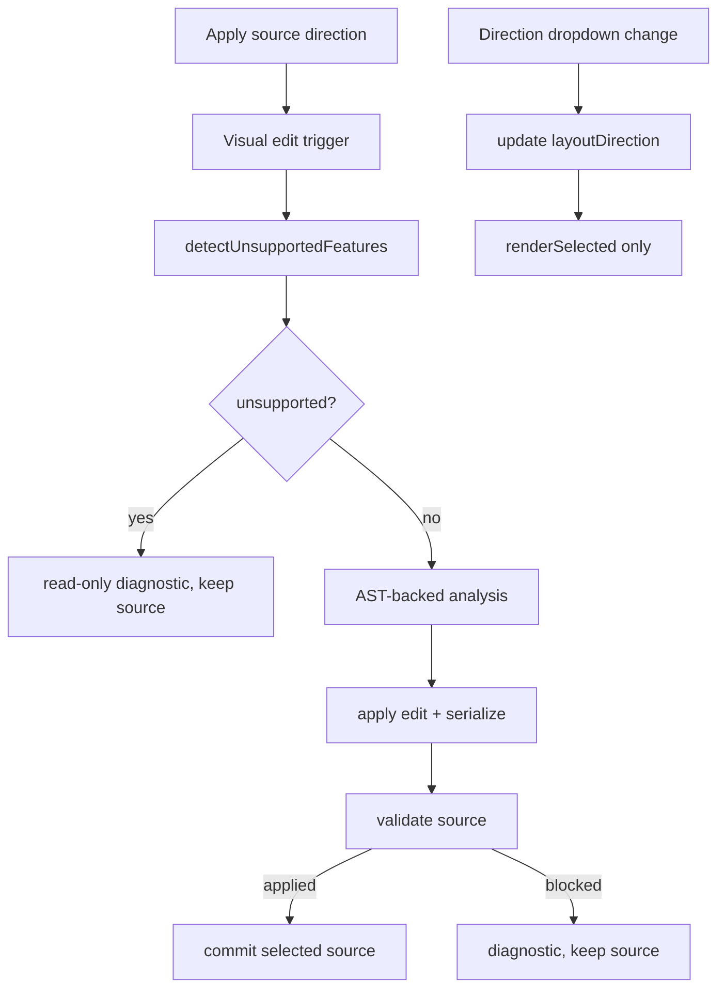

# visual-edit-safety-gate design

## 0. 术语约定

- **Visual safety gate**：visual edit 反写前的阻断层；只要 source 含当前 support analyzer 已知 unsupported syntax，就不执行 source rewrite。
- **Read-only visual state**：source 可预览但不可 visual rewrite；UI 用 diagnostics 说明原因。
- **Preview-only direction**：toolbar direction select 只影响 `layoutConfig.direction`，不修改 Mermaid source。
- **Source direction edit**：用户显式点击 source-direction apply 控件后，才通过 AST-backed visual edit 修改 Mermaid header direction。
- **Roundtrip validation**：source edit 后至少执行 parser-level validation；完整 render/layout gate 留给 `visual-roundtrip-contract-tests` 覆盖。

防冲突结论：现有 `data-xm-layout-direction` 名称保留，但语义改为 preview-only。新增 `data-xm-apply-source-direction` 表示明确 source rewrite 动作，避免继续让一个 dropdown 同时承担两种行为。

## 1. 决策与约束

### 需求摘要

本 feature 解决两类静默破坏：一是 source 含 `classDef`、`style`、`click`、HTML/Markdown label 等当前 support matrix 明确 unsupported 的语法时，visual edit 不应靠 serializer 丢掉这些行；二是方向下拉不应在用户只想看预览布局时直接改 Mermaid source。成功标准：unsupported source 的 visual edit 返回诊断并保留原文；方向 dropdown 只改 preview layout；source direction 只有通过明确按钮才 rewrite，并复用 AST analysis/validation。

明确不做：

- 不实现完整 render/layout roundtrip fixture 矩阵；下一条 roadmap 处理。
- 不新增 Mermaid parser 支持面，也不把 unsupported syntax 转成 supported。
- 不做拖拽画布、节点坐标、shape/style 编辑 UI。
- 不改变普通 selected source textarea 的手动编辑能力。
- 不引入 LLM、网络调用或新 npm dependency。

### 复杂度档位

- 健壮性 = L3（偏离普通 UI 控件默认 L2：这是 source rewrite 安全门，必须 fail-closed）。
- 结构 = modules（复用 `src/support.ts` 的 production support analyzer，不在 editor 里再造 unsupported scanner）。
- 可测试性 = contract tests + UI tests（helper diagnostic 和 live editor toolbar 行为都要覆盖）。

### 关键决策

- Visual safety gate 复用 `detectUnsupportedFeatures(source)`。该 analyzer 是生产支持合同的机器可读入口，能覆盖当前声明 unsupported 的 flowchart syntax。
- `analyzeFlowchartForVisualEdit()` 在 parse 前先检查 unsupported features；命中时返回 `capability: 'read-only'`、`model: null` 和 `visual_unsupported_syntax` diagnostics。
- Direction dropdown 改为 preview-only：改变 `layoutDirection` 后只调用 `renderSelected()`，不调用 `applyVisualEdit({ type: 'set-direction' })`。
- 新增 source-direction apply 按钮；点击后才调用 visual edit `set-direction`，并经过 analysis + validation + `replaceDiagramSource()`。
- Visual edit async queue 保留，source-direction apply 也进入同一队列，避免和其它 visual 操作竞争。

### 前置依赖

Roadmap 前置 `visual-flowchart-ast-contract` 已完成。当前代码已有 AST-backed analysis/validation 和 support analyzer。

## 2. 名词与编排

### 2.1 名词层

**现状**：

- `src/support.ts` 提供 `detectUnsupportedFeatures(source)`，可识别 current support matrix 的 unsupported diagram family 和 flowchart syntax。
- `src/editor/flowchart.ts` 的 `analyzeFlowchartForVisualEdit()` 只做 parse -> AST -> graph model；没有先检查 support analyzer。
- `src/editor/index.ts` 的 direction select change 直接执行 `set-direction` visual edit，导致 source rewrite。

**变化**：

- `VisualFlowchartParseOptions` 增加可选 unsupported detector 注入点，默认使用 `detectUnsupportedFeatures`。
- `VisualEditDiagnostic` 的 `range` 复用 support analyzer range，用于 diagnostics panel 显示行号。
- `XMermaidLiveEditor` toolbar 新增 `data-xm-apply-source-direction` button。
- `layoutDirection` 表示当前 preview override；source direction rewrite 只由 apply source direction button 触发。

接口示例：

```ts
// 来源：src/editor/flowchart.ts analyzeFlowchartForVisualEdit
const analysis = await analyzeFlowchartForVisualEdit('flowchart TD\n  A-->B\n  classDef hot fill:#fff');
analysis.capability; // 'read-only'
analysis.diagnostics[0].code; // 'visual_unsupported_syntax'
```

```ts
// 来源：src/editor/index.ts XMermaidLiveEditor toolbar
directionSelect.value = 'LR';
directionSelect.dispatchEvent(new Event('change'));
// selected source 仍是 flowchart TD；render request layoutConfig.direction 为 LR
applySourceDirectionButton.click();
// selected source 经过 validation 后变为 flowchart LR
```

### 2.2 编排层



**现状**：direction dropdown 同时是 preview config 和 source edit trigger；visual edit analysis 不知道 support analyzer 的 unsupported syntax，serializer 可能把 unsupported 行丢掉。

**变化**：

- visual edit analysis 先执行 safety gate；命中 unsupported feature 时不构造 graph model。
- diagnostics panel 显示 `visual_unsupported_syntax`，range 来自 unsupported feature。
- direction dropdown change 只更新 preview layout override 和 rerender。
- source direction button 调用同一 visual edit queue，edit 类型仍是 `set-direction`。

流程级约束：

- safety gate fail-closed：只要 unsupported features 非空，visual rewrite 不执行。
- preview-only direction 不写 document text，不改 selected source textarea。
- source direction edit 必须复用 AST analysis + validation，不能直接 regex 替换 header。
- blocked visual edit 不清空上一张成功 preview；只更新 diagnostics。

### 2.3 挂载点清单

- `src/editor/index.ts`：toolbar 新增 `data-xm-apply-source-direction` source edit 控件。
- `src/editor/flowchart.ts`：analysis 入口接入 support analyzer safety gate。

本 feature 不新增 package export 子路径、示例页面入口、配置 key 或外部服务注册项。

### 2.4 推进策略

1. 合同红灯：新增 tests 覆盖 unsupported source 阻断和 direction dropdown preview-only。
   退出信号：当前实现会因为 source 被改写或 unsupported 未阻断而失败。
2. Safety gate：接入 `detectUnsupportedFeatures`，把 unsupported features 转为 visual diagnostics。
   退出信号：analysis tests 通过，blocked source 保留原文。
3. Direction split：dropdown 改 preview-only，新增 apply source direction button。
   退出信号：UI tests 证明 dropdown 不改 source，button 才改 source。
4. Diagnostics/queue 联调：blocked visual edit 显示 diagnostics，source-direction apply 复用 visual edit queue。
   退出信号：live editor tests 通过，连续操作无竞争。
5. 验证覆盖：运行 targeted tests、full tests、typecheck、yaml/diff checks。
   退出信号：相关 checks 全部通过。

### 2.5 结构健康度与微重构

##### 评估

- 文件级 — `src/editor/index.ts`：793 行，偏胖；本 feature 只新增一个 toolbar button 和改 direction change handler，拆分 DOM class 会超出安全门本身。
- 文件级 — `src/editor/flowchart.ts`：450 行，承担 visual graph contract；接入 support analyzer 属于 analysis 入口职责延伸。
- 文件级 — `src/support.ts`：现有 analyzer 不需要结构调整。
- 目录级 — `src/editor/`：4 个文件，未达到目录摊平阈值。
- compound convention：`.codestable/compound` 无现有 convention 文档。

##### 结论：不做微重构

继续保持窄改。`src/editor/index.ts` 的体积问题已在上一 feature 标记为后续 `cs-refactor` 候选，但本 feature 不做 DOM class 拆分。

## 3. 验收契约

关键场景：

- S1：source 含 `classDef` → visual rename/add/remove 不提交 source rewrite，diagnostics 显示 `visual_unsupported_syntax`。
- S2：source 含 unsupported syntax 时，selected source 和 document textarea 保持原文。
- S3：direction dropdown 从 `TD` 改 `LR` → 下一次 render request 的 `layoutConfig.direction` 为 `LR`，selected source/document 仍为 `flowchart TD`。
- S4：点击 apply source direction → selected source/document 经过 validation 后变为 `flowchart LR`。
- S5：apply source direction 遇到 unsupported source → 不改 source，显示 visual diagnostic。
- S6：普通 visual rename 在 supported source 上仍能反写，并保留 AST-backed shape/style 语义。

反向核对项：

- 不新增 Mermaid parser 支持面。
- 不新增拖拽画布、shape/style 编辑 UI。
- 不引入新 dependency、LLM 或网络调用。
- 不把完整 render/layout roundtrip fixture 矩阵塞进本 feature。
- 不改变手动编辑 selected source textarea 的行为。

## 4. 与项目级架构文档的关系

验收阶段需要更新 `.codestable/architecture/ARCHITECTURE.md` 的 live editor visual edit 段落：记录 visual safety gate 使用 production support analyzer fail-closed；direction toolbar 是 preview-only；source direction edit 由明确按钮触发并复用 AST-backed validation。Requirement `production-support-contract` 需要追加 visual edit safety gate 已实现的边界说明。
