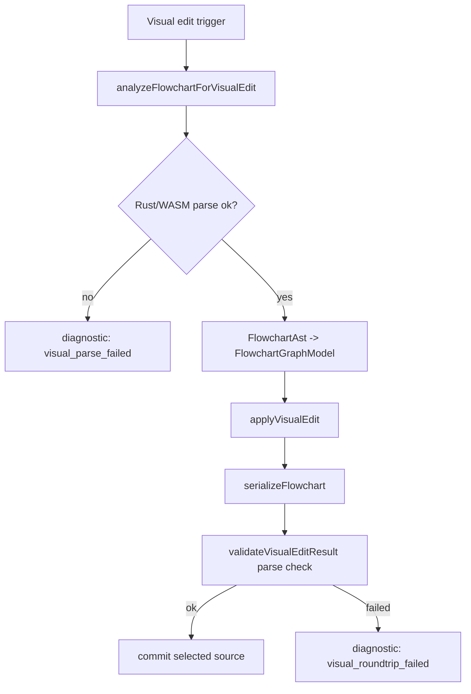

# visual-flowchart-ast-contract design

## 0. 术语约定

- **Visual graph model**：`FlowchartGraphModel`，live editor visual panel 执行 rename/add/remove/set-direction 的内存模型。
- **AST-backed analysis**：先用 Rust/WASM `parse_dsl(source)` 得到 `FlowchartAst`，再派生 visual graph model；不再用独立 regex parser 判断语义支持面。
- **Support matrix semantics**：当前 Rust parser 已能表达的 direction、node shape、edge style、edge label、min_length 和 subgraphs。
- **Normalized Mermaid**：visual edit 反写生成的规范化 Mermaid 片段；不保留原始空白、注释和排版。
- **Visual validation**：对反写后的 source 至少能重新经 Rust/WASM parser 接受的检查；完整 render/layout 闭环由后续 `visual-edit-safety-gate` 和 `visual-roundtrip-contract-tests` 扩展。

防冲突结论：`parseFlowchartToGraph` 现有名称已被测试和 public export 使用，保留为 legacy/simple helper 不删除；新增 `analyzeFlowchartForVisualEdit` 表示“可信 AST-backed 入口”，避免同名函数语义偷偷换掉导致调用方误判同步/异步边界。

## 1. 决策与约束

### 需求摘要

本 feature 修复 `visual-flowchart-editor-v1` 的核心合同缺陷：visual editor 当前用 regex-only helper 构造 graph model，只覆盖 `A[Label] --> B[Label]`，会丢失 Rust parser 已支持的 shape、edge style、edge label、direction 和 subgraph 语义。成功标准是：visual editor 的可信 model 来源变为 Rust/WASM AST；graph model 和 serializer 都能保留当前 support matrix 声明支持的 AST 字段；public helper contract 暴露 AST-backed analysis 和 validation 入口。

明确不做：

- 不实现拖拽式画布、节点坐标编辑或新的 UI 控件。
- 不承诺保留用户原始格式、注释、空白和分号布局。
- 不新增完整 Mermaid 语法支持；Rust parser 不支持的语法仍不在本 feature 补。
- 不把 direction toolbar 拆成 preview-only/source-edit 两种 UI；这是 `visual-edit-safety-gate`。
- 不建立完整真实 render/layout roundtrip fixture 矩阵；这是 `visual-roundtrip-contract-tests`。
- 不引入新 npm dependency。

### 复杂度档位

- 健壮性 = L3（偏离静态 MVP 默认 L2：这是反写语义合同，失败必须可诊断，不能静默生成丢语义 source）。
- 结构 = modules（延续 `src/editor/flowchart.ts` 的模块边界；不把 AST 转换逻辑塞进 live editor DOM class）。
- 可测试性 = contract tests（新增 helper-level tests 覆盖 AST -> model -> serialize 的语义保留）。

### 关键决策

- `FlowchartGraphNode.shape` 和 `FlowchartGraphEdge.style/min_length` 变为 model 合同字段，不再是可选装饰；缺省值只能在“新增节点/边”操作里显式填 `rect` / `arrow` / `1`。
- 新增 AST-backed async helper，默认通过 `initWasm()` + `getWasm().parse_dsl()` 解析 source；测试和未来 runtime 可注入 parse 函数，避免 DOM editor 直接依赖 regex。
- `parseFlowchartToGraph(source)` 暂时保留为 legacy 同步 helper，减少 public API 破坏；visual editor 新路径不得再以它作为语义权威。
- Serializer 输出 normalized Mermaid，并覆盖当前 parser 支持的核心 shape 和 edge style；遇到 subgraph 时按 AST model 输出 subgraph/end 块，孤立节点保留独立声明。
- 反写后 validation 先保证 `nextSource -> Rust/WASM parse` 成功；完整 render/layout 失败回滚的 UI 门禁留给下一项。

### 前置依赖

Roadmap 前置 `visual-flowchart-editor-v1` 已完成；本 feature 依赖现有 `src/types/ast.ts` 的 `FlowchartAst` / `NodeShape` / `EdgeStyle` / `Subgraph` 类型和 `src/wasm.ts` 的 `parse_dsl` wrapper。

## 2. 名词与编排

### 2.1 名词层

**现状**：

- `src/editor/flowchart.ts` 定义 `FlowchartGraphNode` / `FlowchartGraphEdge` / `FlowchartGraphModel`，但 `shape` / `style` 是可选字段，model 没有 `subgraphs`。
- `parseFlowchartToGraph(source)` 是 regex helper，只识别简单节点 label 和箭头边。
- `src/types/ast.ts` 已有 `FlowchartAst`，包含 `direction`、`nodes[]`、`edges[]` 和 `subgraphs[]`，节点含 `shape`，边含 `style` / `label` / `min_length`。
- `src/wasm.ts` 暴露 `parse_dsl(input): string`，可得到 Rust parser 序列化 JSON。

**变化**：

- `FlowchartGraphNode` 固化为 `{ id, label, shape }`；AST label 为 `null` 时 graph label 用 `id`。
- `FlowchartGraphEdge` 固化为 `{ id, from, to, label?, style, min_length }`。
- `FlowchartGraphModel` 新增 `subgraphs: Subgraph[]`。
- 新增 `VisualSourceCapability`、`VisualEditDiagnostic`、`VisualSourceAnalysis`、`VisualEditApplyResult`，用于表达 AST-backed analysis/validation 结果。
- 新增 `flowchartAstToGraph(ast)`、`analyzeFlowchartForVisualEdit(source, options?)`、`validateVisualEditResult(nextSource, options?)`。

接口示例：

```ts
// 来源：src/types/ast.ts FlowchartAst + src/editor/flowchart.ts FlowchartGraphModel
const model = flowchartAstToGraph({
  type: 'flowchart',
  direction: 'LR',
  nodes: [{ id: 'A', label: 'Start', shape: 'rounded', classes: [], styles: [] }],
  edges: [{ from: 'A', to: 'B', style: 'thick', label: 'yes', min_length: 1 }],
  subgraphs: [],
});
model.nodes[0].shape; // 'rounded'
model.edges[0].style; // 'thick'
```

```ts
// 来源：src/wasm.ts parse_dsl + src/editor/flowchart.ts analyzeFlowchartForVisualEdit
const analysis = await analyzeFlowchartForVisualEdit('flowchart LR\n  A(Start) ==> B[End]');
if (analysis.capability === 'editable') {
  const nextModel = applyVisualEdit(analysis.model, { type: 'rename-node', nodeId: 'A', label: 'Begin' });
  const nextSource = serializeFlowchart(nextModel);
}
```

### 2.2 编排层



**现状**：`XMermaidLiveEditor.applyVisualEdit()` 同步调用 regex `parseFlowchartToGraph()`，然后 `applyVisualEdit()` 和 `serializeFlowchart()`，最后直接 `commitSelectedSource()`。方向下拉也走同一条 source rewrite path。

**变化**：

- visual edit 入口改为 async：先调用 AST-backed analysis，只有 `editable + model` 才继续 edit。
- `applyVisualEdit()` 仍保持纯函数，只修改 graph model，不碰 source/DOM/WASM。
- `serializeFlowchart()` 负责从完整 graph model 输出 normalized source，并保留支持字段。
- `validateVisualEditResult()` 对 next source 执行 parse validation；失败时返回 `blocked`，调用方保留原 source。
- legacy `parseFlowchartToGraph()` 只作为同步 fallback/helper，不再在 visual editor 编排中决定可编辑性。

流程级约束：

- WASM parse 失败必须转成 `visual_parse_failed` diagnostic，不静默返回空 graph。
- 删除节点仍必须删除 incident edges。
- 新增节点默认 `shape: 'rect'`；新增边默认 `style: 'arrow'`、`min_length: 1`。
- `TD` / `TB` 在 graph model 中都允许；serializer 输出 source direction 时保留 graph model 值。
- 本 feature 的 validation 只承诺 parser-level parse success；render/layout 级阻断在后续 safety gate 加严。

### 2.3 挂载点清单

- `src/editor/index.ts`：visual edit source rewrite 编排改为调用 AST-backed analysis/validation。
- `src/editor/index.ts` / `src/index.ts`：新增 visual analysis/validation helper 的 public export。

本 feature 不新增页面入口、toolbar control、package export 子路径、配置 key 或外部服务注册项。

### 2.4 推进策略

1. 合同红灯：用 helper-level tests 锁定 AST-backed model 字段和 serializer 语义。
   退出信号：新增 tests 在当前 regex-only implementation 上失败。
2. 名词合同：补齐 `FlowchartGraphModel` 字段和 AST -> model 转换。
   退出信号：AST conversion tests 通过，既有 model tests 更新为显式 shape/style。
3. Serializer 语义保留：覆盖 supported node shape、edge style、edge label、direction 和 subgraph 输出。
   退出信号：serialize tests 通过，normalized output 能表达支持字段。
4. WASM analysis/validation 编排：新增 async analysis + validation helper，并保留 parse 函数注入 seam。
   退出信号：parse success/failure tests 通过，无真实 WASM 依赖的单测可验证诊断结构。
5. Live editor 接入：visual edit path 改用 AST-backed analysis/validation 后再 commit。
   退出信号：visual editor UI tests 仍通过，并新增一条 shape/style 不被 rename 丢失的测试。
6. 验证覆盖：运行 targeted tests、typecheck、yaml/diff checks。
   退出信号：相关 checks 全部通过。

### 2.5 结构健康度与微重构

##### 评估

- 文件级 — `src/editor/index.ts`：748 行，DOM 编排、toolbar、diagnostics、visual edit 都集中在一个 class；本 feature 只需改 visual edit 调用点，继续大规模拆分会混入行为外重构。
- 文件级 — `src/editor/flowchart.ts`：165 行，职责集中在 visual flowchart model/edit/serialize；AST conversion 属于同一模块职责，可以在当前文件内承接。
- 文件级 — `src/wasm.ts`：小型 WASM wrapper，只需消费现有接口，不需要改结构。
- 目录级 — `src/editor/`：当前有 `index.ts`、`flowchart.ts`、`repair.ts`、`share.ts`，未达到目录摊平阈值；不需要新目录。
- compound convention：`.codestable/compound` 无现有 convention 文档。

##### 结论：不做微重构

本 feature 应保持行为变更和结构治理分离。`src/editor/index.ts` 已偏胖，但要拆 DOM class 会涉及文件移动、private 方法边界和测试定位，不是“只搬不改行为”的低风险前置。当前只在 visual edit 编排点做窄改。后续如果继续扩 visual editor UI，应另走 `cs-refactor` 拆 editor runtime / toolbar / diagnostics / visual panel。

## 3. 验收契约

关键场景：

- S1：给定 `FlowchartAst`，包含 rounded/circle/diamond 等 supported shape → `flowchartAstToGraph()` 返回的 nodes 保留 shape，label null 时用 id。
- S2：给定 `FlowchartAst`，包含 arrow/line/dotted/thick/invisible edge style、edge label 和 `min_length` → graph edges 保留这些字段并生成稳定 edge id。
- S3：给定包含 subgraph 的 AST → graph model 保留 `subgraphs`，serializer 输出 `subgraph ... end` 块，不把其中节点丢成顶层无归属节点。
- S4：对含 non-rect shape 和 non-arrow edge 的 source 执行 rename-node → next source 仍包含原 shape/style 语义。
- S5：WASM parse 成功的 flowchart source → `analyzeFlowchartForVisualEdit()` 返回 `capability: editable` 和非空 model。
- S6：WASM parse 失败或非 flowchart AST → analysis 返回 `unsupported/read-only` + diagnostic，不提交 source rewrite。
- S7：`validateVisualEditResult(nextSource)` parse 成功 → 返回 `status: applied`；parse 失败 → 返回 `blocked` 且 model 为 null。

反向核对项：

- 不新增拖拽画布、坐标编辑或 visual UI 控件。
- 不新增 parser 对 Mermaid 未支持语法的 Rust 实现。
- 不引入 LLM、网络调用或新 npm dependency。
- 不把 `parseFlowchartToGraph()` 作为 live editor visual edit 的语义权威。
- 不承诺保留原始注释、空白或格式。
- 不把完整 render/layout roundtrip fixture 矩阵塞进本 feature。

## 4. 与项目级架构文档的关系

验收阶段需要更新 `.codestable/architecture/ARCHITECTURE.md` 的 live editor / visual edit 段落：把当前 `parseFlowchartToGraph()` regex v1 事实改为 AST-backed visual analysis 合同，记录 visual graph model 保留 direction、node shape、edge style、edge label、min_length 和 subgraphs，并说明 serializer 仍输出 normalized Mermaid、不保留格式。方向控制拆分和完整 roundtrip gate 仍作为 roadmap 后续约束，不提前写成现状。
