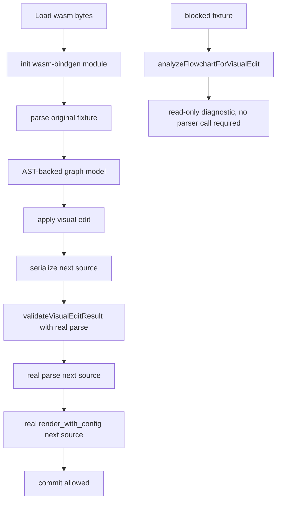

# visual-roundtrip-contract-tests design

## 0. 术语约定

- **Real WASM roundtrip**：测试直接初始化 `pkg/xmermaid_wasm.js` + `pkg/xmermaid_wasm_bg.wasm`，调用真实 `parse_dsl()` 和 `render_with_config()`，不是 mock `src/wasm.ts`。
- **Visual edit roundtrip fixture**：一段 flowchart source，经过 analysis → edit → serialize → validation 后，next source 仍能被真实 WASM parse/render 接受，并保留已支持 AST 语义。
- **Blocked fixture**：包含当前 support analyzer 明确 unsupported syntax 的 source；visual edit 必须 fail-closed，不生成 next source。
- **Support semantics**：当前合同覆盖 node shape、edge style、edge label、direction、subgraph 和 blocked unsupported syntax。

防冲突结论：现有 `tests/live-editor.test.ts` 主要是 jsdom/UI/helper tests，里面大量 mock/injected parser。新增真实 WASM 合同放独立 `tests/visual-roundtrip.test.ts`，避免把 heavy fixture 混进 live editor UI 单测。刻薄 review 后补充 runtime gate：`validateVisualEditResult()` 必须在 parse 成功后执行 render/layout validation，否则 roadmap 4.5 的“parse + render/layout validation”没有真正落到产品路径。

## 1. 决策与约束

### 需求摘要

本 feature 为前两条 visual edit 合同补真实运行时证据，并把 runtime validation 从 parse-only 补成 parse + render/layout：不是只证明 TypeScript helper 在 mock AST 上工作，而是证明 serializer 输出的 next Mermaid 能重新经过 Rust/WASM parser 和 render path。成功标准：supported shapes、edge styles、labels、subgraph、direction edit 都有真实 WASM parse/render 证据；unsupported syntax 被 safety gate 阻断；runtime 在 commit source 前能捕捉 render/layout validation failure。

明确不做：

- 不新增新的 UI 控件或用户工作流；仅补齐 existing visual commit path 的 render/layout validation gate。
- 不新增 Mermaid parser 支持面。
- 不引入 Playwright 或浏览器 fixture；真实 WASM API 足够证明 parse/render contract。
- 不做截图或视觉像素基线。
- 不引入新 npm dependency。

### 复杂度档位

- 健壮性 = L3（合同测试必须真实调用 WASM，不允许 mock）。
- 结构 = test + narrow runtime gate（新增独立测试文件；review 发现 roadmap 4.5 要求 render/layout validation，因此定点修改 `validateVisualEditResult()`）。
- 可测试性 = fixture matrix（每个 supported/blocked 语义有明确 fixture）。

### 关键决策

- 测试用 `readFileSync('pkg/xmermaid_wasm_bg.wasm')` 把 bytes 传给 wasm-bindgen default init，避开 Node 对 `fetch(file:)` 的限制。
- 测试调用 `flowchartAstToGraph()` / `applyVisualEdit()` / `serializeFlowchart()` / `analyzeFlowchartForVisualEdit()` / `validateVisualEditResult()`，但 parse/render 验证必须用真实 WASM module。
- Supported fixture 先 parse original source，再由 AST-backed graph 执行 edit，serialize 后再真实 parse/render。
- Blocked fixture 使用 `classDef`，证明 safety gate 在 AST parser 前阻断，不靠 WASM parse/render 偶然表现。
- `validateVisualEditResult()` 在 parse 成功且 AST type 为 flowchart 后调用 render/layout validator；render/layout 失败返回 `visual_render_failed` 并阻断 commit。

### 前置依赖

Roadmap 前置 `visual-flowchart-ast-contract` 和 `visual-edit-safety-gate` 已完成。当前工作树已有最新 `pkg/`，并且 `npm run build` 可生成最新 WASM package。

## 2. 名词与编排

### 2.1 名词层

**现状**：

- `tests/live-editor.test.ts` 覆盖 helper 和 UI 行为，但多用 injected parser，不证明真实 WASM parse/render。
- `pkg/xmermaid_wasm.js` 支持传入 wasm bytes 初始化后调用 `parse_dsl()`、`render_with_config()`。
- `src/editor/flowchart.ts` 已提供 AST-backed visual edit helpers。

**变化**：

- 新增 `tests/visual-roundtrip.test.ts`。
- 新增测试内 `parseWithRealWasm(source)`、`renderWithRealWasm(source)` 小 helper。
- Fixture 覆盖 supported syntax 和 blocked syntax。
- `VisualFlowchartParseOptions` 新增 `renderDsl?: FlowchartDslRenderer`；默认 render validator 调用 `getWasm().render_with_config(source, null)`。

接口示例：

```ts
// 来源：tests/visual-roundtrip.test.ts
const ast = parseWithRealWasm('flowchart TD\n  A(Start) ==>|yes| B{End}');
const model = flowchartAstToGraph(ast);
const nextSource = serializeFlowchart(applyVisualEdit(model, { type: 'rename-node', nodeId: 'A', label: 'Begin' }));
expect(parseWithRealWasm(nextSource).nodes[0].shape).toBe('rounded');
expect(renderWithRealWasm(nextSource).nodes.length).toBeGreaterThan(0);
```

### 2.2 编排层



**现状**：真实 WASM parse/render 只在 product render tests 和 browser smoke 间接出现，没有专门证明 visual edit serializer 的 source 可被 WASM 吃回去。

**变化**：

- 测试 fixture 直接串起 visual edit helper 和真实 WASM。
- supported fixture 断言 AST semantic fields 未丢。
- blocked fixture 断言 safety gate fail-closed。
- runtime validation 从 parse-only 改为 parse + render/layout；render/layout 失败返回 `visual_render_failed`。

流程级约束：

- 测试不能 mock `src/wasm.ts`。
- 如果 `pkg/` 过期，`npm run build` 是验证前置；acceptance 报告必须记录。
- 不提交 generated `dist/` / `pkg/` 产物。

### 2.3 挂载点清单

本 feature 引入一个定点产品挂载点和一个测试挂载点：

- `src/editor/flowchart.ts`：`validateVisualEditResult()` 增加 render/layout validation gate。
- `src/editor/index.ts` / `src/index.ts`：导出 `FlowchartDslRenderer`，live editor 可注入 `renderFlowchartDsl` 以保持测试/宿主可控。
- `tests/visual-roundtrip.test.ts`：新增真实 WASM visual roundtrip contract tests。

### 2.4 推进策略

1. 合同红灯：新增真实 WASM roundtrip tests，先验证测试能调用 WASM 并捕捉当前合同。
   退出信号：测试在缺 fixture/缺 helper 时失败，或直接通过已有实现则证明前两条已满足该合同。
2. Fixture 矩阵：补 supported shapes/styles/labels/subgraph/direction edit 和 blocked unsupported source。
   退出信号：所有 fixture 有明确断言。
3. 验证覆盖：运行 `npm run build`、targeted test、full tests、typecheck、yaml/diff checks。
   退出信号：相关 checks 全部通过。

### 2.5 结构健康度与微重构

##### 评估

- 文件级 — `tests/live-editor.test.ts`：已 1400+ 行，不再继续塞真实 WASM fixture。
- 文件级 — `src/editor/flowchart.ts` / `src/editor/index.ts`：刻薄 review 发现 runtime parse-only validation 未满足 roadmap 4.5，允许定点补 render/layout gate，不做其它产品改动。
- 目录级 — `tests/`：已有多份 focused test 文件，新增 `visual-roundtrip.test.ts` 符合现状。
- compound convention：`.codestable/compound` 无现有 convention 文档。

##### 结论：不做微重构

测试按新文件隔离即可。`tests/live-editor.test.ts` 已偏胖，但拆历史 UI tests 是后续 refactor，不作为本 test-only feature 前置。

## 3. 验收契约

关键场景：

- S1：supported shape/style/label source 经过 rename-node → next source 真实 WASM parse 后仍保留 rounded/diamond/thick/label。
- S2：subgraph source 经过 rename-node → next source 真实 WASM parse 后仍有 subgraph 且 render 成功。
- S3：direction edit TD -> LR → next source 真实 WASM parse direction 为 LR，render 成功。
- S4：blocked `classDef` source → analysis 返回 `read-only` + `visual_unsupported_syntax`，不产生 rewrite。
- S5：测试初始化真实 WASM bytes，不 mock `src/wasm.ts`。
- S6：parse 成功但 render/layout validation 失败 → `validateVisualEditResult()` 返回 `blocked` + `visual_render_failed`，不允许 commit。

反向核对项：

- 不新增新的 UI 控件或用户工作流；runtime 只允许补齐 roadmap 4.5 声明的 render/layout validation gate。
- 不新增 parser 支持。
- 不新增 dependency。
- 不提交 generated `dist/` / `pkg/`。
- 不新增截图/视觉基线资产。

## 4. 与项目级架构文档的关系

验收阶段需要更新 `.codestable/architecture/ARCHITECTURE.md`：记录 visual edit 当前有真实 WASM roundtrip contract tests，覆盖 supported AST semantics、direction source edit、subgraph 和 blocked unsupported syntax；同时记录 `validateVisualEditResult()` 的 runtime render/layout gate。Requirement `production-support-contract` 追加测试门禁与 runtime validation 事实。
