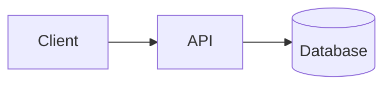

# Browser examples shipped unsupported shape syntax

## 1. Problem

`examples/live-editor.html` and `examples/basic.html` seeded user-facing browser examples with Mermaid cylinder shape syntax such as `DB[(Database)]`.

That syntax is now explicitly documented as error-severity unsupported because the Rust parser cannot roundtrip it correctly.

## 2. Reproduction

Open the live editor example after the production support analyzer blocks cylinder shape syntax:

The example source contains syntax that `detectUnsupportedFeatures()` reports as `flowchart.cylinderShape`.

## 3. Expected Behavior

Browser examples should demonstrate the current production support contract. They must not seed syntax that the SDK preflight blocks before rendering.

## 4. Impact

- The first-run live editor example could show diagnostics instead of a clean preview.
- The examples contradicted README/support matrix claims immediately after support-boundary hardening.
- This weakens release smoke confidence because the consumer smoke uses a different, safer fixture than the public example page.
