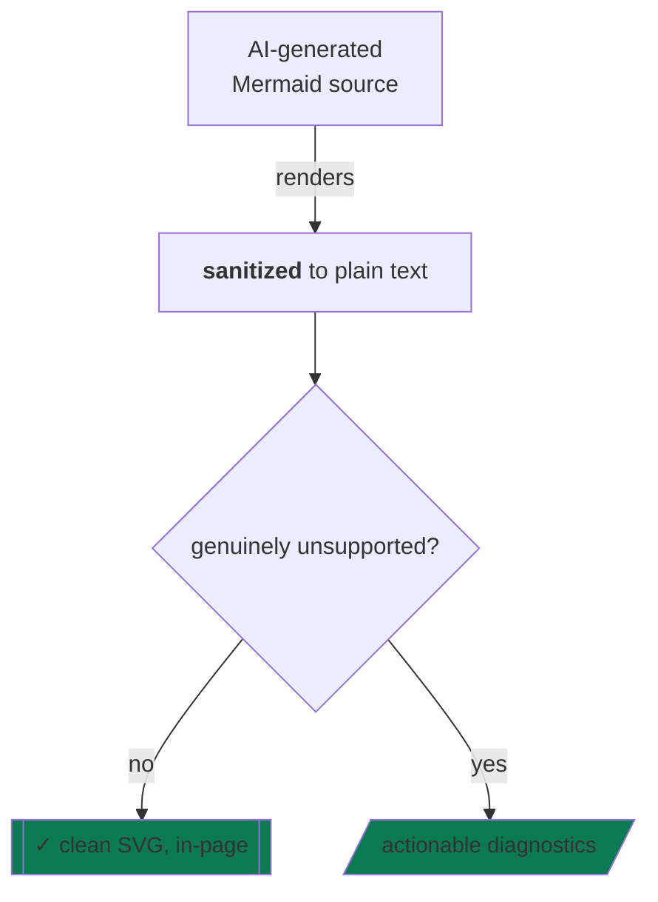

# xmermaid

[English](README.md) | [Chinese](README.zh-CN.md)

[](https://www.npmjs.com/package/@evangwt/xmermaid)
[](https://www.npmjs.com/package/@evangwt/xmermaid)
[](https://github.com/evangwt/xmermaid/actions/workflows/publish-npm.yml)
[](LICENSE)
[](https://evangwt.github.io/xmermaid-live/)

**Your AI writes Mermaid. xmermaid renders it — no cleanup pass required.** The syntax AI output is full of — `<br>` labels, Markdown strings, edge ids, cosmetic styles — gets sanitized and drawn in your browser. What genuinely cannot render comes back *before* any rendering, as a structured diagnostic with a source range you can paste straight back into the prompt.


<p>
  <a href="https://evangwt.github.io/xmermaid-live/"><strong>Try the live editor</strong></a>
  &nbsp;|&nbsp;
  <a href="https://www.npmjs.com/package/@evangwt/xmermaid"><strong>View on npm</strong></a>
</p>

## The loop it closes

1. The model emits a diagram.
2. `analyzeSupport()` answers before WASM runs: it renders, and exactly which syntax doesn't.
3. What renders, draws. What doesn't returns structured diagnostics with stable codes and `line:column` ranges.
4. Paste the diagnostic into your next prompt — fixed diagram, zero guesswork.

## What AI writes vs. what you get

| The model writes | xmermaid does |
| --- | --- |
| `A["line one<br/>line two"]` | Two-line label with real breaks |
| `B["\`**bold** plan\`"]` | Markdown string → plain text |
| `C e1@--> D` | Edge renders, id dropped |
| `E -- "quoted label" --> F` | Quoting kept as text |
| `classDef ok fill:#0b7a53,font-size:15px` | Color applied; `font-size` accepted |
| `click A callback` | Warning: no-op in static SVG |

## Why xmermaid

- **AI-syntax tolerant.** Hazardous-looking labels and styles are sanitized and rendered — never a blank canvas with a thrown error.
- **Rust, in the browser.** Parse, layout, and render compile to one WebAssembly module; the whole SDK ships in a ~1 MB tarball. No server, no upload, no main-thread JS graph stack.
- **Honest by construction.** A machine-readable support matrix covers the Mermaid 11.16.0 catalog (30 families) and is queryable from code — the boundary is data, not documentation.

## xmermaid vs. mermaid.js

| | mermaid.js | xmermaid |
| --- | --- | --- |
| Engine | JavaScript on the main thread | Rust → WebAssembly, TypeScript SVG renderer |
| HTML in labels | Rendered as live markup by default | Never trusted HTML — plain text + `<br>` breaks |
| Support boundary | Discovered at render time, by failing | `analyzeSupport()` answers before you render |
| Failure mode | Thrown errors | Structured diagnostics with stable codes and ranges |
| Untrusted input | Safe mode is opt-in | Strict is the default; blocks before WASM runs |

mermaid.js covers more syntax. xmermaid covers a documented subset — and tells you exactly where the line is.

## Quick start

```bash
npm install @evangwt/xmermaid
```

```ts
import { XMermaid, analyzeSupport } from '@evangwt/xmermaid';

const source = 'flowchart TD\n  A[Start] --> B{OK?} -->|yes| C[End]';
console.log(analyzeSupport(source).status); // 'partial'

const renderer = new XMermaid({ container: document.getElementById('diagram')! });
await renderer.render(source);
```

Browser SDK: the ESM bundle parses under Node/SSR tooling, but DOM rendering needs a browser.

## What your AI writes, rendered



## Know before you render

```ts
const report = analyzeSupport(source);
// { diagramType, status: 'supported' | 'partial' | 'planned' | 'unsupported',
//   message, unsupportedFeatures: [{ id, range, message, severity }] }
```

`unsupportedFeatures` carries a `range` per finding — show a placeholder, disable export, or feed the list back to the model that wrote the diagram. `getSupportMatrix()` exposes the full contract programmatically: every family, per-feature syntax notes.

## Embed the live editor

```ts
import { XMermaidLiveEditor } from '@evangwt/xmermaid/editor';

const editor = new XMermaidLiveEditor({
  root: document.getElementById('editor')!,
  initialText: '```mermaid\nflowchart TD\n  A --> B\n```',
});

await editor.mount();
```

Extracts every diagram from a whole document (fenced or bare), AST-backed visual editing, share hash, SVG export.

## SVG API

```ts
const result = await renderer.renderToSVGElement(source);
document.body.appendChild(result.svg); // { diagramType, diagnostics, dimensions, svg }

const svgText = await renderer.renderToSVGString(source);
```

`XMermaid.run()` scans a page and renders every `.mermaid` element, writing structured error data into the ones that fail.

## Themes

```ts
import { DARK_THEME, type RenderTheme } from '@evangwt/xmermaid';

const theme: Partial<RenderTheme> = {
  ...DARK_THEME,
  colors: { ...DARK_THEME.colors, nodeStroke: '#67e8f9' },
  curveStyle: 'step',
};

await renderer.renderToSVGElement(source, { theme });
```

`LIGHT_THEME` / `DARK_THEME` presets ship beside the `DEFAULT_THEME` compatibility default.

A `%%{init: {'theme': 'dark'}}%%` directive in the source overrides the programmatic theme, matching Mermaid precedence (`default`, `dark`, `neutral`, `light`, `forest`, `base`, `minimal`).

## What renders today

The Mermaid 11.16.0 catalog (30 documented families), as partial Mermaid support:

| Family | Status |
| --- | --- |
| `flowchart` / `graph` | **The core.** Deep native coverage — below |
| `user-journey`, `gantt`, `pie` | Fully supported today |
| `sequenceDiagram`, `classDiagram`, `stateDiagram`, `erDiagram` | Partial — deep coverage of each core grammar |
| `mindmap`, `timeline`, `gitgraph`, `requirementDiagram`, `quadrantChart`, `zenuml`, `sankey`, `xychart-beta`, `block-beta`, `packet`, `venn-beta`, `kanban`, `architecture-beta`, `C4*`, `radar-beta`, `treemap`, `swimlane`, `ishikawa`, `event-modeling`, `wardley`, `cynefin`, `treeview` | Partial — core structure renders; advanced styling does not |

Every family accepts `accTitle` / `accDescr` accessibility directives and `---` frontmatter. Planned families are rejected before WASM renders — never half-rendered.

**Flowcharts (the core):**

- All four directions; `&`-chaining; pipe and inline edge labels; extended edges
- Full core shape set, plus `A@{ shape: stadium, label: "..." }` expanded shapes
- **Subgraph containers** render as labeled boxes; edges can target container ids
- Safe `classDef <name>` / `class` / `style` / `linkStyle` with **safe color values** and numeric `stroke-width` / `stroke-dasharray`; cosmetic properties are accepted-and-ignored
- Decoded entity-code labels (`#9829;`); FontAwesome 4 labels embed as SVG icons
- Fail-closed limits: invalid directions, unsafe style values, subgraph `direction` (parsed, ignored), `click` (no-op in static output). **Visual editing is read-only** for class-styled sources

**Sequence · class · state · ER:**

- `sequenceDiagram` — participants, message endings, create/destroy, boxes, autonumber, activation, notes, colored frames, nested control blocks; no multi-line notes yet
- `classDiagram` — full relation grammar, member blocks, namespaces, `classDef` / `cssClass` styles; `click` downgraded to a warning
- `stateDiagram` — choice/fork/join pseudostates, notes, composite states (flattened, warned)
- `erDiagram` — full crow's-foot cardinality grammar, attribute blocks with PK/FK/UK keys

**Gantt · pie · journey:** fully supported — dates, durations, milestones, working-day `excludes`; slices, titles, `showData`; tasks, scores, sections.

This is partial Mermaid support, not full Mermaid compatibility. The subset is documented here and enforced fail-closed.

## Diagnostics

- Renderable-but-unsupported syntax → `unsupported_syntax` warnings
- Invalid directions, unknown families → error-severity blocks; unknown families report `unsupported_diagram_type`
- WASM failures → normalized `XMermaidError` with structured diagnostics (Rust parser errors may carry `range: null`)

## Security policy

- `strict` by default: blocks `click` callbacks (`security_blocked_click`) and URL protocols outside `http:` / `https:` / `mailto:` (`security_blocked_url`) before rendering
- HTML labels are never rendered as trusted HTML — sanitized to plain text at parse time, at every security level
- `sanitizeSvg: true` walks output SVG and removes `script`, `foreignObject`, inline handlers, dangerous `href`
- `loose` only unblocks `click`; `javascript:` and `data:` stay blocked

## WASM and packaging

The tarball ships JS bundles, TypeScript declarations, and `dist/xmermaid_wasm_bg.wasm`, resolved next to the built JS entry. Custom asset bases pass an explicit URL on the render that first initializes WASM:

```ts
await renderer.renderToSVGElement(source, {
  wasm: {
    wasmUrl: new URL('/assets/xmermaid_wasm_bg.wasm', window.location.href),
    fetch: window.fetch.bind(window),
  },
});
```

WASM init is process-global: after the module is initialized, later renders reuse it. Change `wasmUrl` / `fetch` before the first render, not between renders.

## Release verification

- **Consumer smoke** — headless Chrome (`CHROME_BIN` for CI) installs the packed tarball, typechecks the public API, imports ESM/CJS, and renders through the default bundle-relative WASM asset resolution
- **Live editor workflow smoke** — through `@evangwt/xmermaid/editor`: multi-diagram selection, visual rename, preview-only direction control, source direction edit, unsupported visual edit blocking, share hash, and SVG export readiness

Maintainers: [docs/production-release-checklist.md](docs/production-release-checklist.md).

## Troubleshooting

- `Chrome executable not found` — install Chrome/Chromium or set `CHROME_BIN`
- `unsupported_diagram_type` — family outside the current support contract
- `unsupported_syntax` — known Mermaid syntax not implemented yet
- `security_blocked_*` — strict policy blocked a risky construct before rendering
- WASM asset load failure — serve `dist/xmermaid_wasm_bg.wasm` beside the built JS bundle

## License

MIT. See [LICENSE](LICENSE).
