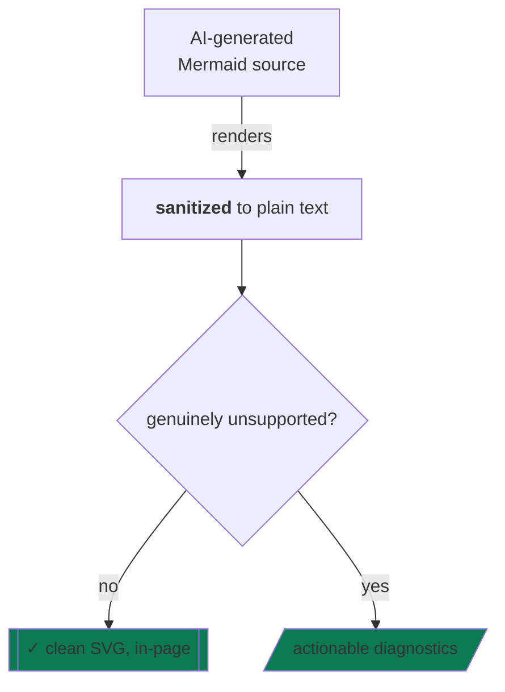

# xmermaid

[English](README.md) | [简体中文](README.zh-CN.md)

[](https://www.npmjs.com/package/@evangwt/xmermaid)
[](https://www.npmjs.com/package/@evangwt/xmermaid)
[](https://github.com/evangwt/xmermaid/actions/workflows/publish-npm.yml)
[](LICENSE)
[](https://evangwt.github.io/xmermaid-live/)

**AI 负责写 Mermaid,xmermaid 负责渲染 —— 无需人工清洗。** AI 输出里最常见的 `<br>` 标签、Markdown 字符串、边 ID、装饰性样式,在这里被清洗后直接画出;真正渲染不了的,在任何渲染发生**之前**返回结构化诊断,带源码位置,可以直接粘回提示词。


<p>
  <a href="https://evangwt.github.io/xmermaid-live/"><strong>在线体验</strong></a>
  &nbsp;|&nbsp;
  <a href="https://www.npmjs.com/package/@evangwt/xmermaid"><strong>npm 包页面</strong></a>
</p>

## 它闭合的循环

1. 模型输出一张图表。
2. `analyzeSupport()` 在 WASM 运行前回答:能不能渲染、哪段语法不能。
3. 能渲染的直接画出;不能的以稳定错误码加 `行:列` 范围返回。
4. 把诊断粘进下一条提示词 —— 图修好了,不用猜。

## AI 写什么,你得到什么

| 模型写出 | xmermaid 处理 |
| --- | --- |
| `A["line one<br/>line two"]` | 双行标签,真实换行 |
| `B["\`**bold** plan\`"]` | Markdown 字符串 → 纯文本 |
| `C e1@--> D` | 边正常渲染,ID 丢弃 |
| `E -- "quoted label" --> F` | 引号按文本保留 |
| `classDef ok fill:#0b7a53,font-size:15px` | 颜色生效;`font-size` 接受 |
| `click A callback` | 警告:静态输出中无效果 |

## 为什么选择 xmermaid?

- **AI 语法宽容。** 看似危险的标签与样式被清洗后渲染 —— 绝不是一块空白画布加一个抛出的异常。
- **Rust,跑在浏览器里。** 解析、布局、渲染编译进单个 WebAssembly 模块,整个 SDK 打包约 1 MB。无服务、无上传、无主线程 JS 图渲染栈。
- **诚实是构造出来的。** 覆盖 Mermaid 11.16.0 目录(30 个图表族)的机器可读支持矩阵可以从代码查询 —— 边界是数据,不是文档。

## 对比 mermaid.js

| | mermaid.js | xmermaid |
| --- | --- | --- |
| 引擎 | 纯 JavaScript，主线程 | Rust → WebAssembly，TypeScript SVG 渲染器 |
| 标签中的 HTML | 默认按活跃标记渲染 | 永不信任 HTML —— 纯文本 + `<br>` 换行 |
| 支持边界 | 渲染时靠失败发现 | `analyzeSupport()` 渲染前给答案 |
| 失败方式 | 抛出错误 | 结构化诊断，稳定错误码 |
| 不受信任输入 | 安全模式需手动开启 | 严格即默认；WASM 运行前拦截 |

mermaid.js 覆盖的语法更多;xmermaid 覆盖一个有文档的子集 —— 并准确告诉你边界在哪条线上。

## 快速开始

```bash
npm install @evangwt/xmermaid
```

```ts
import { XMermaid, analyzeSupport } from '@evangwt/xmermaid';

const source = 'flowchart TD\n  A[Start] --> B{OK?} -->|yes| C[End]';
console.log(analyzeSupport(source).status); // 'partial'

const renderer = new XMermaid({ container: document.getElementById('diagram')! });
await renderer.render(source);
```

面向浏览器的 SDK：ESM 包可被 Node/SSR 工具解析，DOM 渲染需要浏览器环境。

## AI 写什么,就渲染什么



每种"危险写法"的际遇：

- **HTML 标签** —— 剥除为纯文本，`<br>` 变成真实换行；永不被信任为 HTML。
- **Markdown 字符串标签** —— 清洗为纯文本。
- **带引号的边标签** —— 保留空格。
- **边 ID** —— 解析并丢弃。
- **装饰性 `classDef` / `style`** —— 校验后解析后忽略；不安全取值快速失败。

## 渲染前先知道结果

```ts
const report = analyzeSupport(source);
// { diagramType, status: 'supported' | 'partial' | 'planned' | 'unsupported',
//   message, unsupportedFeatures: [{ id, range, message, severity }] }
```

把 `unsupportedFeatures` 回传给写出这张图的模型，或在 WASM 运行前就展示占位提示。`getSupportMatrix()` 以编程方式暴露完整契约：每个图表族、逐特性语法说明。

## 内嵌在线编辑器

```ts
import { XMermaidLiveEditor } from '@evangwt/xmermaid/editor';

const editor = new XMermaidLiveEditor({
  root: document.getElementById('editor')!,
  initialText: '```mermaid\nflowchart TD\n  A --> B\n```',
});

await editor.mount();
```

从整篇文档提取全部图表（围栏或裸图表）、AST 校验的可视化编辑、分享 hash、SVG 导出。

## SVG API

```ts
const result = await renderer.renderToSVGElement(source);
document.body.appendChild(result.svg); // { diagramType, diagnostics, dimensions, svg }

const svgText = await renderer.renderToSVGString(source);
```

`XMermaid.run()` 扫描页面渲染所有 `.mermaid` 元素，并把结构化错误数据写入失败的元素。

## 图表主题

```ts
import { DARK_THEME, type RenderTheme } from '@evangwt/xmermaid';

const theme: Partial<RenderTheme> = {
  ...DARK_THEME,
  colors: { ...DARK_THEME.colors, nodeStroke: '#67e8f9' },
  curveStyle: 'step',
};

await renderer.renderToSVGElement(source, { theme });
```

`LIGHT_THEME` / `DARK_THEME` 预设与 `DEFAULT_THEME` 兼容默认值并存。

源码中的 `%%{init: {'theme': 'dark'}}%%` 指令优先于程序传入主题，与 Mermaid 优先级一致（`default`、`dark`、`neutral`、`light`、`forest`、`base`、`minimal`）。

## 当前支持范围

覆盖 Mermaid 11.16.0 目录（30 个有文档的图表族），为部分 Mermaid 支持：

| 图表族 | 状态 |
| --- | --- |
| `flowchart` / `graph` | **核心。** 原生覆盖最深 —— 见下 |
| `user-journey`、`gantt`、`pie` | 当前完全支持 |
| `sequenceDiagram`、`classDiagram`、`stateDiagram`、`erDiagram` | 部分支持 —— 各族核心语法深度覆盖 |
| `mindmap`、`timeline`、`gitgraph`、`requirementDiagram`、`quadrantChart`、`zenuml`、`sankey`、`xychart-beta`、`block-beta`、`packet`、`venn-beta`、`kanban`、`architecture-beta`、`C4*`、`radar-beta`、`treemap`、`swimlane`、`ishikawa`、`event-modeling`、`wardley`、`cynefin`、`treeview` | 部分支持 —— 核心结构原生渲染；高级样式暂不支持 |

所有图表族接受 `accTitle` / `accDescr` 可访问性指令与 `---` frontmatter。`planned` 的图表族在 WASM 渲染前被拒绝 —— 绝不半渲染。

**流程图（核心）：**

- 全部四个方向；`&` 组合；管道与内联边标签；延长边
- 完整核心形状集，外加持 `A@{ shape: stadium, label: "..." }` 扩展形状
- **子图容器**渲染为带标签的容器框，边可连接容器 ID
- 安全的 `classDef <名称>` / `class` / `style` / `linkStyle`：仅限**安全颜色值**与数值 `stroke-width` / `stroke-dasharray`；定义可包含 `fill`、`stroke`、`color`（安全颜色值），外观属性校验后解析后忽略
- 实体编码标签解码（`#9829;`）；FontAwesome 4 标签以 SVG 图标嵌入
- 快速失败的边界：无效方向、不安全的样式取值、子图内 `direction`（解析但忽略）、`click`（静态输出无效果）；包含 class 声明的源码在可视化编辑中保持只读

**时序 · 类 · 状态 · ER：**

- `sequenceDiagram` —— 参与者、消息端点、create/destroy、box 分组、autonumber、激活、备注、着色框、嵌套控制块；多行备注暂不支持
- `classDiagram` —— 完整关系语法、成员块、namespace、`classDef` / `cssClass` 样式；`click` 降级为警告
- `stateDiagram` —— choice/fork/join 伪状态、备注、复合状态（扁平化并警告）
- `erDiagram` —— 完整鸦脚基数语法，属性块带 PK/FK/UK 标记

**甘特 · 饼图 · 旅程：** 完全支持 —— 日期、时长、里程碑、工作日 `excludes`；扇区、标题、`showData`；任务、评分、分区。

这是部分 Mermaid 支持，不是完整的 Mermaid 兼容实现。子集在本文档中说明，并以快速失败方式强制执行。

## 诊断

- 可渲染但不支持的语法 → `unsupported_syntax` 警告
- 无效方向、未知图表族 → 错误级阻止；未知图表族报 `unsupported_diagram_type`
- WASM 失败 → 规范化为 `XMermaidError`，带结构化诊断（Rust 解析错误可能带 `range: null`）

## 安全策略

- 默认 `strict`：渲染前阻止 `click` 回调（`security_blocked_click`）与 `http:` / `https:` / `mailto:` 白名单外的 URL 协议（`security_blocked_url`）
- HTML 标签在任何安全级别下都不会被当作可信 HTML 渲染 —— 解析时即清洗为纯文本
- `sanitizeSvg: true` 遍历输出 SVG，移除 `script`、`foreignObject`、内联事件处理器、危险 `href`
- `loose` 仅解除 click 阻止；`javascript:` 与 `data:` 始终被阻止

## WASM 与打包

发布包含 JS bundle、TypeScript 声明与 `dist/xmermaid_wasm_bg.wasm`，默认从构建后的 JS 入口相邻路径解析。自定义资源基路径时，在第一次初始化 WASM 的那次渲染传入显式 URL：

```ts
await renderer.renderToSVGElement(source, {
  wasm: {
    wasmUrl: new URL('/assets/xmermaid_wasm_bg.wasm', window.location.href),
    fetch: window.fetch.bind(window),
  },
});
```

WASM 初始化进程全局：模块初始化后，后续渲染复用同一实例。请在第一次渲染前而非渲染之间修改 `wasmUrl` / `fetch`。

## 发布验证

- **消费者冒烟** —— 无头 Chrome（CI 中设 `CHROME_BIN`）安装打包 tarball、类型检查公共 API、导入 ESM/CJS、经默认的 bundle 相邻 WASM 资源解析完成渲染
- **在线编辑器工作流冒烟** —— 经 `@evangwt/xmermaid/editor`：多图表选择、可视化重命名、仅预览方向控制、源码方向编辑、不支持的可视化编辑阻止、分享 hash、SVG 导出就绪

维护者入口：[docs/production-release-checklist.md](docs/production-release-checklist.md)。

## 常见问题

- `Chrome executable not found` —— 安装 Chrome/Chromium 或设置 `CHROME_BIN`
- `unsupported_diagram_type` —— 图表族不在当前支持范围内
- `unsupported_syntax` —— 已识别但尚未实现的 Mermaid 语法
- `security_blocked_*` —— 严格策略在渲染前阻止了风险构造
- WASM 资源加载失败 —— 在构建后的 JS bundle 旁提供 `dist/xmermaid_wasm_bg.wasm`

## 许可证

MIT。完整文本见 [LICENSE](LICENSE)。
